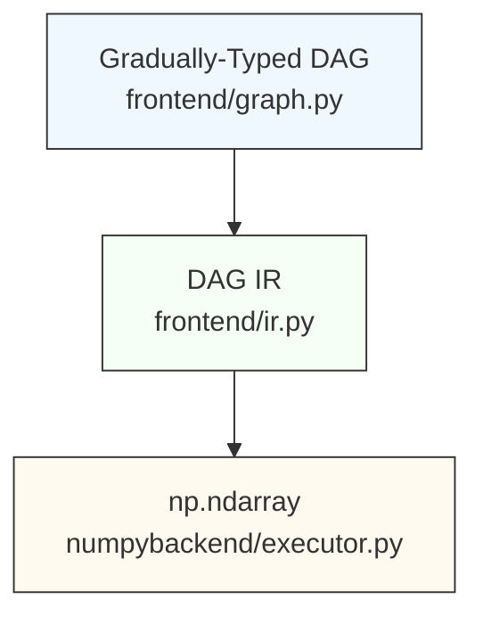

# DSL Compiler Engine

|                  |                                                |
| ---------------- | ---------------------------------------------- |
| Author           | [@bassosimone](https://github.com/bassosimone) |
| Last-Updated     | 2025-07-30                                     |
| Status           | Draft                                          |
| Approved-By      | N/A                                            |

The [dt_model](../../civic_digital_twins/dt_model) package includes
[engine](../../civic_digital_twins/dt_model/engine):
a compiler for an embedded domain specific language (DSL). We use this
DSL to represent computations required to evaluate the satisfiability
of civic-digital-twin models constraints.

(See the [Appendix](#appendix) for a glossary.)

## TL;DR

This section provides a compact introduction to the compiler design
and architecture. Subsequent sections provide a more gentle
introduction to the topic — along with examples — and explain
the design rationale more in detail.

**DSL.** The programmer writes DSL code, either directly or indirectly, i.e.,
using classes defined in the [dt_model](../../civic_digital_twins/dt_model)
package. Each operation in the DSL defines a *node*. The programmer may
add explicit type annotation to nodes. In such a case, a static type
checker, such as [pyright](https://github.com/microsoft/pyright), will
produce static type checking errors when trying to mix nodes having
incompatible types. The errors will be rendered in visual editors as
red error squiggles. Type annotation is optional and gradual. Any unannotated node
is implicitly annotated with the `Unknown` type. Operations involving
nodes using the `Unknown` type *are not* type checked. This allows untyped
DSL code to be written quickly, but disables static checking on
operations involving those nodes.

**Placeholders and Constants.** The DSL allows the programmer to include
scalar constant values (including strings, numbers, and bools) and
placeholders. A placeholder represents a value that will be provided
by the programmer at evaluation time.

**User-Defined Functions.** The DSL allows the programmer to include
nodes representing user-defined functions. Each user-defined function
takes in input an arbitrary number of nodes and produces in output
a single node. When lowering the code to [NumPy](https://github.com/numpy/numpy),
user defined functions are transformed into concrete functions taking
in input zero or more `np.ndarray` and returning a `np.ndarray`.

**DAG.** The written DSL code is as a [directed acyclic graph](
https://en.wikipedia.org/wiki/Directed_acyclic_graph) (DAG).

**Linear Topological Sorting vs Tree Partitioning.** The programmer may either
produce a linear [topological sorting](https://en.wikipedia.org/wiki/Topological_sorting)
of the DAG or partition the DAG into topologically sorted trees. For
both use cases, the input is a list of root nodes whose value needs to
be evaluated. The linear sorting produces the sequence of operations
that evaluates each root node in the correct order. The tree-based
sorting produces a subtree for each root node. A tree depends on other
nodes (constants, placeholders, and results produced by other trees)
and contains topologically sorted nodes sequencing operations correctly
to evaluate the tree root node. The tree view makes the dependencies
between each tree explicit (which helps with debugging) and potentially
unblocks optimizations such as [JIT-compiling](
https://en.wikipedia.org/wiki/Just-in-time_compilation) a tree.

**DAG Intermediate Representation (IR).** Regardless of whether the
programmer used linear sorting or tree paritioning, it is possible to
produce an intermediate representation of the DAG suitable to be
mapped to low-level numeric operations through simple transformations.

**Support for Multiple Backends.** The DAG IR is abstract and
may be evaluated by distinct backends. Currently, we only implement
a [NumPy](https://github.com/numpy/numpy) backend. However,
the code can easily be extended to support other backends,
such as [TensorFlow](https://github.com/tensorflow/tensorflow).
Because of this possibility, the compiler is conceptually split into
a backend-agnostic *frontend* and specific *backends*.

**NumPy Evaluation.** To evaluate a DAG we evaluate either the linear
topological sorting of the nodes or the topologically sorted trees.
The evaluation uses a *State* data structure (functionally equivalent
to a dictionary mapping a node to the `np.ndarray` result of
its evaluation). The basic evaluation algorithm uses a Python-based
interpreter to map nodes to the corresponding NumPy operations, reading
required node values from the State and writing results to the
State. Thus, nodes are only evaluated once. A more advanced, experimental
evaluation strategy transforms a tree to a Python function using
NumPy calls and uses [Numba](https://github.com/numba/numba) to
JIT-compile these functions to efficient code. Preliminary benchmarks
indicate that using Numba is useful when the same code is evaluated
multiple times with equally shaped constants and placeholders.

## End-To-End Example

```Python
import numpy as np

from civic_digital_twins.dt_model.engine.frontend import forest, graph, ir
from civic_digital_twins.dt_model.engine.numpybackend import executor


# Define types
class TimeDimension:
    """Represents nodes in the time dimension."""


class EnsembleDimension:
    """Represents nodes in the ensemble dimension."""


# Define a type-aware DAG
a = graph.placeholder[TimeDimension]("a")
b = graph.placeholder[TimeDimension]("b")
k0 = graph.constant(3, name="k0")
c = a + b * k0
c1 = graph.function_call("reduce", c)
d = a * k0 - b
d1 = graph.function_call("reduce", d)

# Partition it into two subtrees for `c` and `d`
trees = forest.partition(c1, d1)

# Create an intermediate DAG representation
dag = ir.compile_trees(*trees)

# Setup initial state including placeholder values
# and the user-defined function `reduce`
state = executor.State(
    values={
        a: np.asarray([100, 10, 1]),
        b: np.asarray([200, 20, 2]),
    },
    functions={
        "reduce": executor.LambdaAdapter(
            lambda n: np.divide(n, np.asarray(5)),
        ),
    },
)

# Evaluate the intermediate representation
executor.evaluate_dag(state, dag)

# Print the results
print(state.get_node_value(c1))
print(state.get_node_value(d1))
```

To observe the program running, save it as `examples/complete.py`
then execute the following commands:

```bash
export DTMODEL_ENGINE_FLAGS=trace
uv run python examples/complete.py
```

This command will trace the evaluation of each node in the
graph using NumPy and produce the computation results. We will
provide more information on the compiler and the tracing
format in the subsequent sections.

## Architecture

The compiler is logically split into a *frontend* and *backends*
specific to the computational library to use. As of 2025-07-30, the
compiler architecture consists of:

1. a [frontend](../../civic_digital_twins/dt_model/engine/frontend)
that deals with a directed acyclic graph (DAG) representing the
computation through Python classes that resembles
[NumPy](https://github.com/numpy/numpy)'s API.

2. a [numpybackend](../../civic_digital_twins/dt_model/engine/numpybackend)
that evaluates the DAG using [NumPy](https://github.com/numpy/numpy).

Additional backends will take the `<backend>backend` name. For example:
`tensorflowbackend`, `jaxbackend`.

## Frontend-Backend Contract

All backends should implement an `evaluate_dag(state, dag)` function
and conform to the semantics defined by the frontend:

```Python
from typing import Protocol, runtime_checkable

from civic_digital_twins.dt_model.engine.frontend import graph, ir

@runtime_checkable
class State(Protocol):
    def set_node_value(self, node: graph.Node, value: np.ndarray) -> None: ...

    def get_node_value(self, node: graph.Node) -> np.ndarray: ...

def evaluate_dag(state: State, dag: ir.DAG) -> np.ndarray|None: ...
```

This design assumes that any backend we may want to use is able to cheaply
convert its internal array representation from/to `np.ndarray`. As discussed
in [#84](https://github.com/fbk-most/civic-digital-twins/issues/84#issuecomment-3129629098),
this assumption seems reasonable for most backends.

## Main Modules: a Quick Reference

| Module | Responsibility |
| ------ | -------------- |
| [`atomic/__init__.py`](../../civic_digital_twins/dt_model/engine/atomic/__init__.py) | Atomic counters. |
| [`compileflags/__init__.py`](../../civic_digital_twins/dt_model/engine/compileflags/__init__.py) | Compile flags definition. |
| [`frontend/forest.py`](../../civic_digital_twins/dt_model/engine/frontend/forest.py) | Forest partitioning. |
| [`frontend/graph.py`](../../civic_digital_twins/dt_model/engine/frontend/graph.py) | Node types and gradually-typed DSL. |
| [`frontend/ir.py`](../../civic_digital_twins/dt_model/engine/frontend/ir.py) | Intermediate DAG representation. |
| [`frontend/linearize.py`](../../civic_digital_twins/dt_model/engine/frontend/linearize.py) | Topological sorting. |
| [`numpybackend/astgen.py`](../../civic_digital_twins/dt_model/engine/numpybackend/astgen.py) | AST generator. |
| [`numpybackend/executor.py`](../../civic_digital_twins/dt_model/engine/numpybackend/executor.py) | Main executor interface. |
| [`numpybackend/jit.py`](../../civic_digital_twins/dt_model/engine/numpybackend/jit.py) | JIT infrastructure. |

## Overall Data Flow



## frontend/graph.py: Writing a DAG

The corresponding module is [frontend/graph.py](../../civic_digital_twins/dt_model/engine/frontend/graph.py).

In principle, end-users should not need to write DAGs by hand. The
examples here are for understanding internals and testing. In production,
DAGs are generated *indirectly* by the
[dt_model](../../civic_digital_twins/dt_model) package.

The following example shows how one could write a simple DSL:

```Python
# Import the `graph` module for manually writing the DAG
from civic_digital_twins.dt_model.engine.frontend import graph

# Define the inputs for the DAG (aka "placeholders").
a = graph.placeholder("a")
b = graph.placeholder("b")

# Define constants used in the DAG. Constants may also be
# specified inline without bothering to create them.
scale = graph.constant(1024)

# Compute a node named `c` using specific operations
c = graph.exp(a) + 55 / a

# Compute a node named `d` using specific operations
d = c * b + scale

# Compute a node named `e` using specific operations
e = graph.power(a, c) * 144
```

This DAG that combines input placeholders (`a` and `b`) and operations (`+`,
`*`, `/`, `graph.exp`, and `graph.power`) to produce specific outputs
(`c`, `d`, and `e`).

To enable optional static type checking of DSL graphs, you
can annotate nodes with types using Python's generics syntax. This
way you will know if you're mixing "apples and oranges". For
example, you could write the following:

```Python
# ...


class Apple:
    """Represent apples."""


class Orange:
    """Represent oranges."""


# Explicitly say that the placeholders are oranges
a = graph.placeholder[Orange]("a")
b = graph.placeholder[Orange]("b")

# Explicitly say that the constants are oranges
scale = graph.constant[Orange](1024)

# ...
```

This ensures that static type checkers, such as
[pyright](https://github.com/microsoft/pyright), produce
static type errors — rendered as squiggles by editors
such as VSCode — when mixing apples and oranges. For example,
the following code mixes incompatible types:

```Python
# ...

# Explicitly say that the placeholders are oranges
a = graph.placeholder[Orange]("a")
b = graph.placeholder[Orange]("b")

# Oops, scale is now an apple and not an orange!
scale = graph.constant[Apple](1024)

# ...

# This line produces an error squiggle because the
# operation is mixing apples and oranges.
d = c * b + scale
```

In practice, assigning distinct types to distinct nodes is
beneficial to avoid programming mistakes, especially with
shapes. For example, a real model could have the ensemble
dimension with shape `(1,)` and the time dimension with
shape `(255,)`. To perform computations in the time-ensemble
dimension, one needs to expand vectors into the `(255,1)`
space. By using types correctly, we avoid mixing dimensions
and reduce the risk of combining nodes with incorrect
shapes by mistake.

Regarding how `graph.py` could be implemented, a very simplified
implementation looks like this:

```Python
# === Extremely simplified `graph.py` implementation (illustrative only) ===


class Node(Generic[T]):
    def __init__(self, name: str) -> None:
        self.name = name

    def __add__(self, other: Node[T]) -> Node[T]:
        return add(self, other)

    # ...


class placeholder(Generic[T], Node[T]):
    def __init__(self, name: str) -> None:
        super.__init__(name)


class constant(Generic[T], Node[T]):
    def __init__(self, value: int | float, name: str = "") -> None:
        super.__init__(name)
        self.value = value


class add(Generic[T], Node[T]):
    def __init__(self, left: Node[T], right: Node[T], name: str = "") -> None:
        super.__init__(name)
        self.left = left
        self.right = right

# ...
```

Basically:

1. We define a generic node and reimplement all the special
operations such as `__add__` so that we can write `a + b` where
`a` and `b` are nodes to obtain an `add` instance.

2. Inputs (i.e., `constant` and `placeholder`) just hold the
related name and value of the node.

3. Operations are nodes that refer to their operands.

Note that we use lowercase names for classes
(a [PEP8](https://peps.python.org/pep-0008/) violation)
because we want names compatible with NumPy (e.g., we want
`graph.add` to correspond to `np.add`).

Additionally, the `graph.function_call` node allows to create
a node that will call a user-defined function. For example:

```Python
# ...

f = graph.function_call("reduce", c, d, e)
```

The programmer will need to supply at evaluation time an
implementation of reduce that looks like this:

```Python
def reduce(c: np.ndarray, d: np.ndarray, e: np.ndarray) -> np.ndarray: ...
```

In the next section, we will start to play around to understand
what is the structure of this DAG that we have created.

## Printing DAG Nodes

Once we have a DAG, we can dump its internal representation by
using `print` on each node in the DAG.

For example, `print(a)` produces the following output:

```Python
n1 = graph.placeholder(name='a', default_value=None)
```

As you can see, a node's string representation is valid Python
code. This is done on purpose. Nodes (and trees), when formatted
to string, produce the code they correspond to.

Let us now check more in detail the meaning of the printed code:

1. we are assigning to `n1` to indicate that the relevant
node is associated with the unique ID `1` (each node is
assigned a unique ID when it is created using the `engine/atomic`
package).

2. `graph.placeholder` is the node type constructor.

3. `name="a"` indicates that the placeholder name is `a`.

4. `default_value=None` indicates that there is no default
value associated with the placeholder.

Similarly, `print(scale)` produces the following output:

```Python
n3 = graph.constant(value=1024, name='')
```

So far, we have dumped constants and placeholders, which are
simple to understand. If we `print(c)`, instead, we get:

```Python
n7 = graph.add(left=n4, right=n6, name='c')
```

This tells us that `c` corresponds to a node with ID `7` that
performs the sum of nodes `4` and `6`. However, we cannot
see nodes `4` and `6` just by dumping `c`. To see what it means
to compute `c`, we need topological sorting, which is the
topic covered by the next section.

By the way, this code-like representation of a node where we have:

```
<targetNode> = <operation>(<operandNodes>)
```

is called [Static-Single-Assignment (SSA) form](https://en.wikipedia.org/wiki/Static_single-assignment_form).

## frontend/linearize.py: Topological Sorting

[Topological sorting](https://en.wikipedia.org/wiki/Topological_sorting)
means producing a linear "plan" to compute a given node.

The corresponding module is [frontend/linearize.py](../../civic_digital_twins/dt_model/engine/frontend/linearize.py).

Let us use `linearize.forest` to produce a topological sorting for `c`:

```Python
# ...

# Let's import the linearize module
from civic_digital_twins.dt_model.engine.frontend import linearize

# Let's generate the plan for producing `c`
plan = linearize.forest(c)

# Let's print all the related nodes in evaluation order
for node in plan:
    print(node)
```

(The operation is called `linearize.forest` because it takes in
input multiple tree roots — e.g., `linearize.forest(a, b, c)` — thus
linearizing a forest of trees embedded into the DAG.)

This is the output that we get:

```Python
n1 = graph.placeholder(name='a', default_value=None)
n4 = graph.exp(node=n1, name='')
n5 = graph.constant(value=55, name='')
n6 = graph.divide(left=n5, right=n1, name='')
n7 = graph.add(left=n4, right=n6, name='')
```

This plan basically tells us that to produce `c`, which is
`n7` (i.e., the node with ID equal to `7`):

1. we need the `n1` placeholder node.

2. we compute the `exp` of `n1` and assign to `n4`

3. we need the constant `55` as `n5`.

4. we perform `n5 / n1` and assign to `n6`.

5. we perform `n4 + n6` and assign to `n7` (our result).

Note that the above representation is just a more verbose
way of writing the original code:

```Python
a = graph.placeholder("a")
c = graph.exp(a) + 55 / a
```

Also, note that when we perform a topological sorting targeting
`c`, we only see the relevant DAG nodes. This makes sense because
we are basically selecting the subgraph tree rooted in `c`.

With topological sorting, we already have a powerful way
of transforming a DAG into an actionable sequence of operations
for producing a value. An alternative approach, discussed in the
next section, is to produce a tree for each node we want to
evaluate (as opposed to producing just a linear list).

## frontend/forest.py: Tree Partitioning

Tree partitioning allows us to construct a tree rooted into
each output node. Each tree depends on placeholders and, possibly,
on nodes computed by other trees and models a function for
computing the output node value given the inputs.

The corresponding module is [frontend/forest.py](../../civic_digital_twins/dt_model/engine/frontend/forest.py).
To perform tree partitioning, we use `forest.partition`.

The general guideline is to partition the DAG using as roots the
desired outputs. However, because some trees may be independent
of each other, more fine grained splitting allows, in principle,
for computing them in parallel.

Let us see what happens when we partition the DAG we created
previously using `c`, `d`, and `e` as the root nodes:

```Python
# Import the partitioning functionality
from civic_digital_twins.dt_model.engine.frontend import forest

# Partition the DAG into trees rooted in `e`, `d`, and `c`
trees = forest.partition(e, d, c)

# Print the results of the partitioning
for tree in trees:
    print(tree)
```

This code produces the following output (which I annotated with
comments showing the original DAG code for clarity):

```Python
# c = graph.exp(a) + 55 / a
def t7(n1: graph.placeholder, n5: graph.constant) -> graph.Node:
    n4 = graph.exp(node=n1, name='')
    n6 = graph.divide(left=n5, right=n1, name='')
    n7 = graph.add(left=n4, right=n6, name='')
    return n7

# e = graph.power(a, c) * 144
def t12(n1: graph.placeholder, n7: graph.Node, n11: graph.constant) -> graph.Node:
    n10 = graph.power(left=n1, right=n7, name='')
    n12 = graph.multiply(left=n10, right=n11, name='')
    return n12

# d = c * b + scale
def t9(n2: graph.placeholder, n3: graph.constant, n7: graph.Node) -> graph.Node:
    n8 = graph.multiply(left=n7, right=n2, name='')
    n9 = graph.add(left=n8, right=n3, name='')
    return n9
```

As I mentioned above, a tree is functionally equivalent to a
function and, unsurprisingly, its string representation is
indeed a Python function, named `tN` where `N` is the ID of the root node.

Note how each function depends on either placeholders or constants
or nodes produced by dependent trees (e.g., `t9` depends on `n7`,
produced by the `t7` tree evaluation).

In terms of actual implementation a minimal tree is like:

```Python
# === Extremely simplified tree implementation (illustrative only) ===


class Tree:
    inputs: set[graph.Node]  # nodes used as the tree input
    nodes: list[graph.Node]  # topologically sorted nodes in the "function" body


# Also note the following invariants:
assert len(tree.nodes) >= 1
assert tree.nodes[-1] is root_node
```

Also, please note that:

1. the body of each function (i.e., the tree nodes used to
evaluate the root node) is topologically sorted;

2. trees depend on either placeholders (such as `n1` and `n2`) or
nodes computed by other trees (such as `n7`).

This representation allows one to clearly see the rules to
compute each tree. Additionally, we could
in principle evaluate independent trees in parallel. This is
not implemented right now, but it should be simple to do.

Also note that we passed `e, d, c` to `forest.partition` and
the function returned trees to execute in the correct
order (i.e., also trees are topologically sorted). Specifically,
since `t9` and `t12` both depend on `n7`,
computed by `t7`, `t7` comes *before* `t9` and `t12`.

As a final note, `forest.py` uses `linearize.py` to
construct topologically sorted nodes for a tree. Namely,
it uses the `boundary=` parameter of `linearize.forest` to
avoid recursing into nodes belonging to other trees.

To summarize, `forest.partition`:

1. returns topologically sorted trees;

2. each tree contains topologically sorted nodes.

## Linear Topological Sorting vs Tree Partitioning

Whether to use `linearize.py` or `forest.py` depends on your
needs when constructing and evaluating the model.

In principle, `linearize.py` is enough to produce a result, but
`forest.py` allows you to explicitly isolate how each root
node is computed and its dependencies.

As such, it seems that `forest.py` is more appropriate when
your goal is understanding the trees embedded in a DAG.

Additionally, for some use cases, including JIT evaluation, we
need to explicitly partition the computation in trees and
JIT-compile each tree independently. (That is, we cannot JIT
compile the linear representation of the nodes save for the
easy case where there's just a single root node we're interested
to evaluate; otherwise, all the intermediate node values will
not be available, since they will be computed by Numba.)

## frontend/ir.py: Intermediate DAG Representation

The [frontend/ir.py](../../civic_digital_twins/dt_model/engine/frontend/ir.py)
module allows to produce an uniform intermediate representation
regardless of whether you used `linearize.py` or `forest.py`. In
the former case, the representation consists of:

1. a sorted-by-ID list of placeholders;
2. a sorted-by-ID list of constants;
3. topologically-sorted nodes to evaluate.

In the latter case, it consists of:

1. a sorted-by-ID list of placeholders;
2. a sorted-by-ID list of constants;
3. topologically-sorted trees to evaluate.

The main design point here is that of isolating the DAG inputs (constants
and placeholders) from the abstract DAG strucutre. This split allows
backend modules to manipulate the inputs ahead of evaluation.

For example, as discussed in [#84](https://github.com/fbk-most/civic-digital-twins/issues/84),
this is the correct place where to remap `np.ndarray` containing strings
to `np.ndarray` containing numbers referring to the strings whenever
the backend we are using does not support strings. This is currently not
a concern, since NumPy supports strings.

A DAG IR could also be printed. Let us cover both cases. Let us start
with code to produce a DAG IR from `linearize.py`'s output:

```Python
# ...

from civic_digital_twins.dt_model.engine.frontend import ir

# Generate the DAG IR from the trees
dag = ir.compile_nodes(*plan)

# Print the DAG IR
print(dag)
```

Executing this program will produce the following output:

```Python
# === placeholders ===
n1 = graph.placeholder(name='a', default_value=None)
n2 = graph.placeholder(name='b', default_value=None)

# === constants ===
n3 = graph.constant(value=1024, name='')
n5 = graph.constant(value=55, name='')
n11 = graph.constant(value=144, name='')

# === nodes ===
n4 = graph.exp(node=n1, name='')
n6 = graph.divide(left=n5, right=n1, name='')
n7 = graph.add(left=n4, right=n6, name='')
n10 = graph.power(left=n1, right=n7, name='')
n12 = graph.multiply(left=n10, right=n11, name='')
n8 = graph.multiply(left=n7, right=n2, name='')
n9 = graph.add(left=n8, right=n3, name='')
```

You can easily see that constants and placeholders are defined independently
at the top, then topologically sorted nodes follow.

Let us now focus on producing and printing a DAG IR from `forest.py` output:

```Python
# ...

from civic_digital_twins.dt_model.engine.frontend import ir

# Generate the DAG IR from the trees
dag = ir.compile_trees(*trees)

# Print the DAG IR
print(dag)
```

Executing this program will produce the following output:

```Python
# === placeholders ===
n1 = graph.placeholder(name='a', default_value=None)
n2 = graph.placeholder(name='b', default_value=None)

# === constants ===
n3 = graph.constant(value=1024, name='')
n5 = graph.constant(value=55, name='')
n11 = graph.constant(value=144, name='')

# === trees ===
def t7(n1: graph.placeholder, n5: graph.constant) -> graph.Node:
    n4 = graph.exp(node=n1, name='')
    n6 = graph.divide(left=n5, right=n1, name='')
    n7 = graph.add(left=n4, right=n6, name='')
    return n7

def t12(n1: graph.placeholder, n7: graph.Node, n11: graph.constant) -> graph.Node:
    n10 = graph.power(left=n1, right=n7, name='')
    n12 = graph.multiply(left=n10, right=n11, name='')
    return n12

def t9(n2: graph.placeholder, n3: graph.constant, n7: graph.Node) -> graph.Node:
    n8 = graph.multiply(left=n7, right=n2, name='')
    n9 = graph.add(left=n8, right=n3, name='')
    return n9
```

You can easily see that constants and placeholders are defined independently
at the top, then tree function definitions follow.

Equipped with knowledge about the DAG IR, we are now ready
to explain how a DAG IR is evaluated in practice.


## numpybackend/executor.py: NumPy Evaluator Interface

The [numpybackend/executor.py](../../civic_digital_twins/dt_model/engine/numpybackend/executor.py)
module allows to evaluate DAG IRs to produce numeric results.

To evaluate a DAG IR, by default, `executor` runs a Python virtual
machine that maps each node to the corresponding NumPy
operation. For example, `graph.add` corresponds to `numpy.add`,
`graph.exp` corresponds to `numpy.exp`, etc.

The `executor` is associated with a state. Such state is
functionally equivalent to a Python dictionary mapping a `graph.Node`
to a `np.ndarray`. Therefore, a barebone executor
implementation looks like this:

```Python
# === Extremely simplified executor implementation (illustrative only) ===

# Define the empty state
state: dict[graph.Node, np.ndarray] = {}

# Assign the placeholder values
state[a] = np.asarray(4)
state[b] = np.asarray(2)

# Define the evaluator function
def evaluate_tree(state: dict[graph.Node, np.ndarray], tree: forest.Tree) -> np.ndarray:
    rv: np.ndarray | None = None
    for node in tree.nodes:

        # compute each node at most once
        if node in state:
            continue

        # execute the proper action depending on the node state
        if isinstance(node, graph.Add):
            rv = np.add(state[node.left], state[node.right])
            state[node] = rv
            continue

        # ...

    assert(rv is not None)
    return rv
```

This evaluator is called "step-by-step" evaluator because it
interprets each node sequentially.

In terms of the *actual* usage, the following code illustrates
how you can use the executor in your code:

```Python
# ...

from civic_digital_twins.dt_model.engine.numpybackend import executor

import numpy as np

# create state with placeholder values
state = executor.State(
    values={
        a: np.asarray(4),
        b: np.asarray(2),
    }
)

# evaluate all the DAG IR
executor.evaluate_dag(state, dag)

# print the "d" result
print(state.get_node_value(d))
```

This code runs an implementation *conceptually* similar to the
one we described above. In compiler terms, this is an interpreter,
written in Python, using node-indexed memory locations (i.e.,
the state) to remember values and make them available to
subsequent operations. We evaluate nodes *at most once* to
avoid performing redundant work. If you need to re-evaluate
a model, you should start from an empty state. However, note
that you can prepopulate the state, if that's needed. Basically,
the current state represents the memory snapshot after the
evaluation of all the trees evaluated so far.

When the DAG IR contains functions, instead of linear nodes,
the executor evaluates the node of each tree in order. Because
trees are topologically sorted and nodes within them are
also topologically sorted, the sequence of evaluated nodes
is equivalent to the one where the DAG contains just the
topologically sorted nodes.

To be more specific, the following tree:

```Python
def t12(n1: graph.Node, n7: graph.Node) -> graph.Node:
    n10 = graph.power(left=n1, right=n7, name='')
    n11 = graph.constant(value=144, name='')
    n12 = graph.multiply(left=n10, right=n11, name='')
    return n12
```

Leads the executor to perform these operations:

```Python
# === Equivalent operations performed by the evaluator ===
state[n10] = np.power(state[n1], state[n7])
state[n11] = np.asarray(144)
state[n12] = np.multiply(state[n10], state[n11])
```

## Tracing execution with `DTMODEL_ENGINE_FLAGS`

The `DTMODEL_ENGINE_FLAGS` environment variable allows to
automatically trace the execution. So, for example, if you
saved your program as `example/basic.py`, the following
`bash` commands:

```bash
export DTMODEL_ENGINE_FLAGS=trace
uv run python example/basic.py
```

Produces the following output:

```Python
# n1 = graph.placeholder(name='a', default_value=None)
n1 = np.asarray(4)
# shape: ()
# dtype: int64
# value:
# 4

# n2 = graph.placeholder(name='b', default_value=None)
n2 = np.asarray(2)
# shape: ()
# dtype: int64
# value:
# 2

# n3 = graph.constant(value=1024, name='')
n3 = np.asarray(1024)
# shape: ()
# dtype: int64
# value:
# 1024

# n5 = graph.constant(value=55, name='')
n5 = np.asarray(55)
# shape: ()
# dtype: int64
# value:
# 55

# n11 = graph.constant(value=144, name='')
n11 = np.asarray(144)
# shape: ()
# dtype: int64
# value:
# 144

# n4 = graph.exp(node=n1, name='')
n4 = np.exp(n1)
# shape: ()
# dtype: float64
# value:
# 54.598150033144236

# n6 = graph.divide(left=n5, right=n1, name='')
n6 = np.divide(n5, n1)
# shape: ()
# dtype: float64
# value:
# 13.75

# n7 = graph.add(left=n4, right=n6, name='')
n7 = np.add(n4, n6)
# shape: ()
# dtype: float64
# value:
# 68.34815003314424

# n10 = graph.power(left=n1, right=n7, name='')
n10 = np.power(n1, n7)
# shape: ()
# dtype: float64
# value:
# 1.4115186353908455e+41

# n12 = graph.multiply(left=n10, right=n11, name='')
n12 = np.multiply(n10, n11)
# shape: ()
# dtype: float64
# value:
# 2.0325868349628174e+43

# n8 = graph.multiply(left=n7, right=n2, name='')
n8 = np.multiply(n7, n2)
# shape: ()
# dtype: float64
# value:
# 136.69630006628847

# n9 = graph.add(left=n8, right=n3, name='')
n9 = np.add(n8, n3)
# shape: ()
# dtype: float64
# value:
# 1160.6963000662886
```

Note that the output is valid Python code (you just need to add `import numpy as np`
at the top to make the script valid). For each node, we print:

1. a comment showing the actual node;
2. valid Python code showing the equivalent NumPy operation;
3. the shape, dtype, and value as comments.

Note that we use `np.asarray` to create constants and placeholders.

## JIT Execution Using Numba

In addition to executing each operation sequentially, the
`evaluator` also allows to
[JIT-compile](https://en.wikipedia.org/wiki/Just-in-time_compilation)
a tree using [Numba](https://github.com/numba/numba).

This functionality is experimental and implemented in
the [#70](https://github.com/fbk-most/civic-digital-twins/pull/70)
pull request.

The advantage of JIT-compiling a tree using Numba is that it
produces machine code optimized for specific inputs. If the
`shape` and `dtype` of the input is always the same, for repeated
computations, the cost of JIT compiling is compensated by running faster
numeric operations during each execution. (If the `shape` and/or the
`dtype` changes, Numba recompiles the function to produce suitable
JIT code, which reduces the performance; that said, in our use cases,
we always evaluate models with the same `shape` and `dtype`, and
only the sizes of each shape may change from run to run.)

Whether or not to use JIT compilation is a matter of profiling
and knowing the requirements of the use case. Yet, it is not
possible to know *whether* JIT would be beneficial without having
the *option* to profile it against normal evaluation. We ran
preliminary benchmarking in [#54](https://github.com/fbk-most/civic-digital-twins/issues/54)
and concluded that the matter is not urgent, but a potential
performance benefit is there and further investigation is needed.

The simplest way to turn on JIT compilation — assuming you are in the
right branch — is to append `jit` to `DTMODEL_ENGINE_FLAGS`:

```bash
# if you only want to use the JIT compiler
export DTMODEL_ENGINE_FLAGS=jit

# but you may also want to combine with tracing
export DTMODEL_ENGINE_FLAGS=jit,trace
```

However specified, the `jit` flag turns on JIT evaluation on a
per-`State` basis. In the current prototype, there is no global
function cache. We may consider this as part of future work,
particularly if we decide to merge this code.

Given the following tree:

```Python
def t12(n1: graph.Node, n7: graph.Node) -> graph.Node:
    n10 = graph.power(left=n1, right=n7, name='')
    n11 = graph.constant(value=144, name='')
    n12 = graph.multiply(left=n10, right=n11, name='')
    return n12
```

the process to JIT-compile it is the following:

1. We transform the tree into a Python
[AST](https://docs.python.org/3/library/ast.html) equivalent
to the following code:

```Python
def t12_jit(n1: np.ndarray, n7: np.ndarray) -> np.ndarray:
    n10 = np.power(n1, n7)
    n11 = np.asarray(144)
    return np.multiply(n10, n11)
```

2. We use the [compile](https://docs.python.org/3/library/functions.html#compile)
built-in function to transform the AST into Python bytecode.

3. We use Numba's `@njit` decorator to wrap the bytecode and
produce a new function, with the same signature, that
internally uses Numba and JIT compilation.

When we transform the tree into an AST, we sort the argument
nodes by increasing node ID. The `evaluate_tree` takes
advantage of this property to pass the arguments to the
function wrapped by `@njit` in the correct order.

The [numpybackend/jit.py](../../civic_digital_twins/dt_model/engine/numpybackend/jit.py)
is the internal module implementing JIT evaluation.

## More `DTMODEL_ENGINE_FLAGS` goodies

First of all the `DTMODEL_ENGINE_FLAGS` allows to set compiler
flags using an environment variable. However, you can also
set flags programmatically. For example:

```Python
# ...

# import the compileflags package to get flags values
from civic_digital_twins.dt_model.engine import compileflags

# create state with placeholder values
state = executor.State(
    values={
        a: np.asarray(4),
        b: np.asarray(2),
    },
    flags=compileflags.JIT|compileflags.TRACE,
)

# ...
```

The above code is equivalent to setting:

```bash
export DTMODEL_ENGINE_FLAG=jit,trace
```

You can combine take advantage of `compileflags.BREAK` to stop the
execution *after* a node has been evaluated:

```Python
# ...

# import the compileflags package to get flags values
from civic_digital_twins.dt_model.engine import compileflags

flags: int = 0
flags |= compileflags.TRACE  # print each node and its value
flags |= compileflags.BREAK  # stop after evaluating a node

# create state with placeholder values
state = executor.State(
    values={
        a: np.asarray(4),
        b: np.asarray(2),
    },
    flags=flags,
)

# ...
```

When using `compileflags.JIT`, `compileflags.TRACE` and
`compileflags.BREAK` are also honored, but we cannot step
inside each JIT-compiled function. Therefore, you can
only see the value of root nodes, which limits your ability
to inspect and debug the evaluation.

Conversely, as mentioned before, `compileflags.JIT` is
more efficient when models are evaluated multiple times,
since the code is compiled to specific machine code
matching the expected shapes.

## User-Defined Functions

Use the `numpybackend.executor.LambdaAdapter` to wrap an
ordinary Python `lambda` and register a user-defined function.

The following code shows some usage examples:

```Python
import numpy as np

from civic_digital_twins.dt_model.engine.frontend import graph, ir, linearize
from civic_digital_twins.dt_model.engine.numpybackend import executor

# Define just two constants to operate on
k0 = graph.constant(100)
k1 = graph.constant(50)
k2 = graph.constant(117)
k3 = graph.constant(1000)

# Call a function that takes arguments in positional order
scaled1 = graph.function_call("scale1", k0, k1)

# Call a function that takes keyword arguments
scaled2 = graph.function_call("scale2", k0=k0, k1=k1)

# Call a function that takes a mixture of arguments
scaled3 = graph.function_call("scale3", k0, k1, k2=k2, k3=k3, scaled2=scaled2)

# Compile to a DAG IR
dag = ir.compile_nodes(*linearize.forest(scaled1, scaled2, scaled3))

# Initialize the evaluation state
state = executor.State(
    values={},
    functions={
        "scale1": executor.LambdaAdapter(
            lambda k0, k1: np.add(k0, k1),
        ),
        "scale2": executor.LambdaAdapter(
            lambda **kwargs: np.add(kwargs["k0"], kwargs["k1"]),
        ),
        "scale3": executor.LambdaAdapter(
            lambda k0, k1, **kwargs: np.add(
                k0, np.add(k1, np.add(kwargs["k2"], np.add(kwargs["k3"], kwargs["scaled2"])))
            ),
        ),
    },
)

# Evaluate the DAG
executor.evaluate_dag(state, dag)

# Print the results
print(f"#{state.get_node_value(scaled1)}")
print(f"#{state.get_node_value(scaled2)}")
print(f"#{state.get_node_value(scaled3)}")
```

Executing this code with `export DTMODEL_ENGINE_FLAGS=trace`
produces the following output:

```Python
# n1 = graph.constant(value=100, name='')
n1 = np.asarray(100)
# shape: ()
# dtype: int64
# value:
# 100

# n2 = graph.constant(value=50, name='')
n2 = np.asarray(50)
# shape: ()
# dtype: int64
# value:
# 50

# n3 = graph.constant(value=117, name='')
n3 = np.asarray(117)
# shape: ()
# dtype: int64
# value:
# 117

# n4 = graph.constant(value=1000, name='')
n4 = np.asarray(1000)
# shape: ()
# dtype: int64
# value:
# 1000

# n5 = graph.function(name='scale1', n1, n2)
n5 = scale1(n1, n2)
# shape: ()
# dtype: int64
# value:
# 150

# n6 = graph.function(name='scale2', k0=n1, k1=n2)
n6 = scale2(k0=n1, k1=n2)
# shape: ()
# dtype: int64
# value:
# 150

# n7 = graph.function(name='scale3', n1, n2, k2=n3, k3=n4, scaled2=n6)
n7 = scale3(n1, n2, k2=n3, k3=n4, scaled2=n6)
# shape: ()
# dtype: int64
# value:
# 1417

#150
#150
#1417
```

## Error Handling

- The topological sorting algorithm will detect cycles
in the DAG and throw an exception in such a case.

- If Numba fails to compile because the code is not purely
functional and numeric, it throws an exception.

- We assume that shapes and dtypes match. We expect static
type checking to help avoiding such mistakes. Yet, in case
of mismatches NumPy or Numba will throw at runtime.

- Evaluating a tree whose input nodes have not been evaluated
yet causes an exception to be throw by the evaluator.

## Testing Strategy

All the compiler code SHOULD have 100% coverage. It is foundational
code upon which the research code depends. We should aim to be
confident that each line is executed at least once and does not crash.
Also, we SHOULD have tests in place ensuring that a graph produces the same
numerical result of the equivalent NumPy code. (As of 2025-07-14,
this is currently the case, yay!)

## Future Work

- We lack a mechanism for profiling the evaluation of individual trees,
which could guide decisions regarding the correct partitioning as
well as on whether to use Numba.

## Conclusion

The compiler provides a complete pipeline: representing computations
as DAGs, possibly partitioning them into evaluable units, and supporting
multiple execution strategies, including a step-by-step
interpreter and JIT-compilation using Numba. This enables flexibility
in balancing debuggability and performance, and allows the system to adapt
to future workloads or computational backends.

## Appendix

### Glossary

**DAG**: [Directed-acyclic graph](https://en.wikipedia.org/wiki/Directed_acyclic_graph) of connected nodes.

**JIT**: Just in Time compilation. When `@numba.njit` functions
are invoked, the first execution generates and caches machine code
for arrays of the given shape. Machine code customized to the
shape is more efficient than generic NumPy code.

**Node**: An operation or value in the computation graph.

**Placeholder**: A symbolic node to be assigned a value at runtime.

**Root**: The root of a tree.

**State**: The runtime memory used during evaluation, mapping each
`graph.Node` to its computed value (`np.ndarray`).

**Tree**: A topologically sorted subgraph rooted at a node,
including all nodes required to compute it.

**User-Specified Function**: Function taking in input `np.ndarray`s
and returning `np.ndarray` that can be called indirectly when
building the tree as long as the function implementation is provided
when we are evaluating the DAG.
