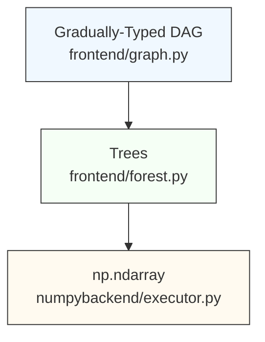
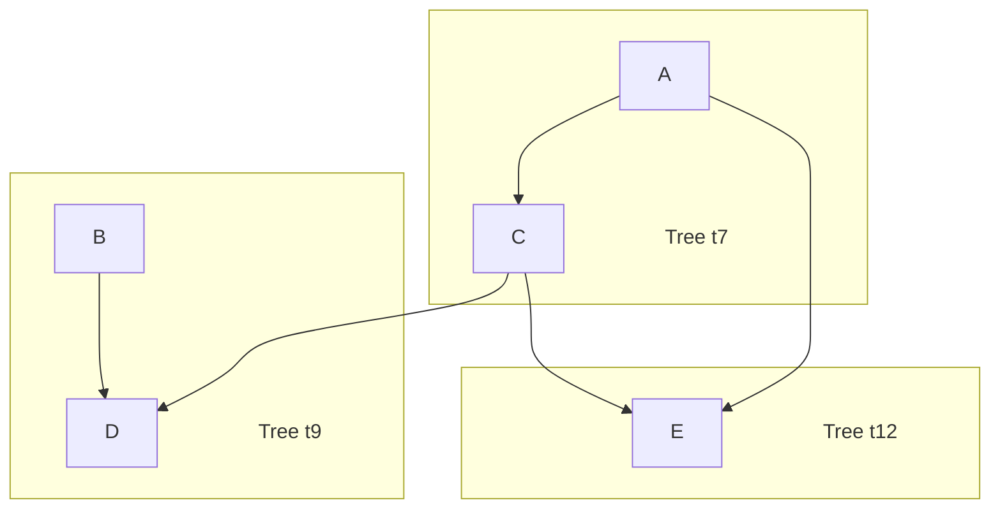

# DSL Compiler Engine for Civic Digital Twins Modeling

|                  |                                                |
| ---------------- | ---------------------------------------------- |
| Author           | [@bassosimone](https://github.com/bassosimone) |
| Last-Updated     | 2025-07-14                                     |
| Status           | Draft                                          |
| Approved-By      | N/A                                            |

The [dt_model](../../civic_digital_twins/dt_model) package includes
[engine](../../civic_digital_twins/dt_model/engine):
a compiler for an embedded domain specific language (DSL). We use this
DSL to represent computations required to evaluate the satisfiability
of civic-digital-twin models constraints.

(See the [Appendix](#appendix) for a glossary.)

## TL;DR

This section provides a compact introduction to the compiler design
and architecture. Subsequent sections provide a more gentle
introduction to the topic — along with examples — and explain
the design rationale more in detail.

**DSL.** The programmer writes DSL code, either directly or indirectly, i.e.,
using classes defined in the [dt_model](../../civic_digital_twins/dt_model)
package. Each operation in the DSL defines a *node*. The programmer may
add explicit type annotation to nodes. In such a case, a static type
checker, such as [pyright](https://github.com/microsoft/pyright), will
produce static type checking errors when trying to mix nodes having
incompatible types. The errors will be rendered in visual editors as
red error squiggles. Type annotation is optional and gradual. Any unannotated node
is implicitly annotated with the `Unknown` type. Operations involving
nodes using the `Unknown` type *are not* type checked. This allows untyped
DSL code to be written quickly, but disables static checking on
operations involving those nodes.

**DAG.** The written DSL code is internally represented as a
[directed acyclic graph](https://en.wikipedia.org/wiki/Directed_acyclic_graph)
(DAG). The initial DSL code forms a single DAG.

**DAG Forest Partitioning.** The programmer partitions the DAG into
trees. Each tree represents a computation function: it consumes input
nodes (placeholders or outputs from other trees) and produces a
result. The programmer explicitly decides which trees to create. Trees are
[topologically sorted](https://en.wikipedia.org/wiki/Topological_sorting),
that is, returned in the order in which they must be evaluated. Each
tree contains list of nodes to evaluate to produce the tree result. Nodes
within a tree are also topologically sorted.

**Support for Multiple Backends.** The trees are abstract and
may be evaluated by distinct backends. Currently, we only implement
a [NumPy](https://github.com/numpy/numpy) backend. However,
the DAG can easily be extended to support other backends,
such as [TensorFlow](https://github.com/tensorflow/tensorflow).
Because of this possibility, the compiler is conceptually split into
a backend-agnostic *frontend* and specific *backends*.

**NumPy Evaluation.** Each tree is evaluated as (functionally) a NumPy
function taking in input multiple [NumPy](https://github.com/numpy/numpy)
multi-dimensional *arrays* (`np.ndarray`) and returning in output a
single array. To evaluate the tree, we evaluate the topologically sorted
nodes. The evaluation uses a *State* data structure (functionally equivalent
to a dictionary mapping a node to the `np.ndarray` result of
its evaluation). The basic evaluation algorithm uses a Python-based
interpreter to map nodes to the corresponding NumPy operations, reading
required node values from the State and writing results to the
State. Thus, nodes are only evaluated once. A more advanced
evaluation strategy transforms a tree to a Python function using
NumPy calls and uses [Numba](https://github.com/numba/numba) to
[JIT-compile](https://en.wikipedia.org/wiki/Just-in-time_compilation)
these functions to efficient code. Using Numba should be more efficient
when the same model is evaluated multiple times.

**NumPy Postprocessing Filters.** It is possible to attach a NumPy
numeric filter to a tree. The numeric filter takes in input the
result of evaluating the tree (a `np.ndarray`) and applies an
algorithm to transform it to another `np.ndarray`. For example,
we can apply [fixed-point iteration](https://en.wikipedia.org/wiki/Fixed-point_iteration)
to modify the tree-computed results. Because these filters are
purely numeric, they can also be JIT-compiled with Numba by
applying the proper `@numba.njit` decorator.

## End-To-End Example

```Python
# Define types
class TimeDimension:
    """Represents nodes in the time dimension."""

class EnsembleDimension:
    """Represents nodes in the ensemble dimension."""

# Define a typed DAG
a = graph.placeholder[TimeDimension]("a")
b = graph.placeholder[TimeDimension]("b")
c = a + b
d = a - b

# Partition it into two subtrees for `c` and `d`
trees = forest.partition(c, d)

# Evaluate with NumPy backend
state = executor.State(values={a: np.ones(1), b: np.ones(1)})
for tree in trees:
    executor.evaluate_tree(state, trees)

# Print the results
print(state.get_node_value(c))
print(state.get_node_value(d))
```

## Architecture

The compiler is logically split into a *frontend* and *backends*
specific to the computational library to use. As of 2025-07-14, the
compiler architecture consists of:

1. a [frontend](../../civic_digital_twins/dt_model/engine/frontend)
that deals with a directed acyclic graph (DAG) representing the
computation through Python classes that resembles
[NumPy](https://github.com/numpy/numpy)'s API.

2. a [numpybackend](../../civic_digital_twins/dt_model/engine/numpybackend)
that evaluates the DAG using [NumPy](https://github.com/numpy/numpy).

Additional backends will take the `<backend>backend` name. For example:
`tensorflowbackend`, `jaxbackend`.

## Frontend-Backend Contract

All backends must implement an `evaluate_tree(state, tree)` function
and conform to the semantics defined by the frontend:

```Python
from typing import Protocol, runtime_checkable

# Assuming that T is the numeric type native of the backend.
# This is `np.ndarray` for NumPy.

@runtime_checkable
class State(Protocol):
    def get_node_value(self, node: graph.Node) -> T: ...

def evaluate_tree(state: State, tree: forest.Tree) -> T: ...
```

By using a consistent interface, we make it easier to swap
different backends without too much refactoring.

## Main Modules: a Quick Reference

| Module | Responsibility |
| ------ | -------------- |
| [`atomic/__init__.py`](../../civic_digital_twins/dt_model/engine/atomic/__init__.py) | Atomic counters. |
| [`compileflags/__init__.py`](../../civic_digital_twins/dt_model/engine/compileflags/__init__.py) | Compile flags definition. |
| [`frontend/forest.py`](../../civic_digital_twins/dt_model/engine/frontend/forest.py) | Forest partitioning. |
| [`frontend/graph.py`](../../civic_digital_twins/dt_model/engine/frontend/graph.py) | Node types and gradually-typed DSL. |
| [`frontend/linearize.py`](../../civic_digital_twins/dt_model/engine/frontend/linearize.py) | Topological sorting. |
| [`numpybackend/astgen.py`](../../civic_digital_twins/dt_model/engine/numpybackend/astgen.py) | AST generator. |
| [`numpybackend/executor.py`](../../civic_digital_twins/dt_model/engine/numpybackend/executor.py) | Main executor interface. |
| [`numpybackend/jit.py`](../../civic_digital_twins/dt_model/engine/numpybackend/jit.py) | JIT implementation. |

## Overall Data Flow



## frontend/graph.py: Writing a DAG

The corresponding module is [frontend/graph.py](../../civic_digital_twins/dt_model/engine/frontend/graph.py).

In principle, end-users should not need to write DAGs by hand. The
examples here are for understanding internals and testing. In production,
DAGs are generated *indirectly* by the
[dt_model](../../civic_digital_twins/dt_model) package.

The following example shows how one could write a simple DSL:

```Python
# Import the `graph` module for manually writing the DAG
from civic_digital_twins.dt_model.engine.frontend import graph

# Define the inputs for the DAG (aka "placeholders").
a = graph.placeholder("a")
b = graph.placeholder("b")

# Define constants used in the DAG. Constants may also be
# specified inline without bothering to create them.
scale = graph.constant(1024)

# Compute a node named `c` using specific operations
c = graph.exp(a) + 55 / a

# Compute a node named `d` using specific operations
d = c * b + scale

# Compute a node named `e` using specific operations
e = graph.power(a, c) * 144
```

This DAG that combines input placeholders (`a` and `b`) and operations (`+`,
`*`, `/`, `graph.exp`, and `graph.power`) to produce specific outputs
(`c`, `d`, and `e`).

To enable optional static type checking of DSL graphs, you
can annotate nodes with types using Python's generics syntax. This
way you will know if you're mixing "apples and oranges". For
example, you could write the following:

```Python
# ...

class Apple:
    """Represent apples."""

class Orange:
    """Represent oranges."""

# Explicitly say that the placeholders are oranges
a = graph.placeholder[Orange]("a")
b = graph.placeholder[Orange]("b")

# Explicitly say that the constants are oranges
scale = graph.constant[Orange](1024)

# ...
```

This ensures that static type checkers, such as
[pyright](https://github.com/microsoft/pyright), produce
static type errors — rendered as squiggles by editors
such as VSCode — when mixing apples and oranges. For example,
the following code mixes incompatible types:

```Python
# ...

# Explicitly say that the placeholders are oranges
a = graph.placeholder[Orange]("a")
b = graph.placeholder[Orange]("b")

# Oops, scale is now an apple and not an orange!
scale = graph.constant[Apple](1024)

# ...

# This line produces an error squiggle because the
# operation is mixing apples and oranges.
d = c * b + scale
```

In practice, assigning distinct types to distinct nodes is
beneficial to avoid programming mistakes, especially with
shapes. For example, a real model could have the ensemble
dimension with shape `(1,)` and the time dimension with
shape `(255,)`. To perform computations in the time-ensemble
dimension, one needs to expand vectors into the `(255,1)`
space. By using types correctly, we avoid mixing dimensions
and ensure that only nodes belonging to the same
dimension can be combined through operations.

Regarding how this could be implemented, a very simplified
implementation looks like this:

```Python
# === Extremely simplified graph implementation (illustrative only) ===


class Node:
    def __init__(self, name: str) -> None:
        self.name = name

    def __add__(self, other: Node) -> Node:
        return add(self, other)

    # ...


class placeholder(Node):
    def __init__(self, name: str) -> None:
        super.__init__(name)


class constant(Node):
    def __init__(self, value: int | float, name: str = "") -> None:
        super.__init__(name)
        self.value = value


class add(Node):
    def __init__(self, left: Node, right: Node, name: str = "") -> None:
        super.__init__(name)
        self.left = left
        self.right = right

# ...
```

Basically:

1. We define a generic node and reimplement all the special
operations such as `__add__` so that we can write `a + b` where
`a` and `b` are nodes to obtain an `add` instance.

2. Inputs (i.e., `constant` and `placeholder`) just hold the
related name and value of the node.

3. Operations are nodes that refer to their operands.

Note that we use lowercase names for classes (a PEP8 violation)
because we want names compatible with NumPy (e.g., we want
`graph.add` to correspond to `np.add`).

In the next section, we will start to play around to understand
what is the structure of this DAG that we have created.

## Printing DAG Nodes

Once we have a DAG, we can dump its internal representation by
using `print` on each node in the DAG.

For example, `print(a)` produces the following output:

```Python
n1 = graph.placeholder(name='a', default_value=None)
```

Where:

1. we are assigning to `n1` to indicate that the relevant
node is associated with the unique ID `1` (each node is
assigned a unique ID when it is created using the `engine/atomic`
package).

2. `graph.placeholder` is the node type constructor.

3. `name="a"` indicates that the placeholder name is `a`.

4. `default_value=None` indicates that there is no default
value associated with the placeholder.

Similarly, `print(scale)` produces the following output:

```Python
n3 = graph.constant(value=1024, name='')
```

So far, we have dumped constants and placeholders, which are
simple to understand. If we `print(c)`, instead, we get:

```Python
n7 = graph.add(left=n4, right=n6, name='c')
```

This tells us that `c` corresponds to a node with ID `7` that
performs the sum of nodes `4` and `6`. However, we cannot
see nodes `4` and `6` just by dumping `c`. To see what it means
to compute `c`, we need topological sorting, which is the
topic covered by the next section.

By the way, this representation of a node where we have a
single operation between nodes that assigns to another node is called
[Static-Single-Assignment (SSA) form](https://en.wikipedia.org/wiki/Static_single-assignment_form).

## frontend/linearize.py: Topological Sorting

[Topological sorting](https://en.wikipedia.org/wiki/Topological_sorting)
means producing a linear "plan" to compute a given node.

The corresponding module is [frontend/linearize.py](../../civic_digital_twins/dt_model/engine/frontend/linearize.py).

Let us use `linearize.forest` to produce a topological sorting for `c`:

```Python
# ...

# Let's import the linearize module
from civic_digital_twins.dt_model.engine.frontend import linearize

# Let's generate the plan for producing `c`
plan = linearize.forest(c)

# Let's print all the related nodes in evaluation order
for node in plan:
    print(node)
```

(The operation is called `linearize.forest` because it takes in
input multiple tree roots, thus linearizing a forest of trees
embedded into the DAG.)

This is the output that we get:

```Python
n1 = graph.placeholder(name='a', default_value=None)
n4 = graph.exp(node=n1, name='')
n5 = graph.constant(value=55, name='')
n6 = graph.divide(left=n5, right=n1, name='')
n7 = graph.add(left=n4, right=n6, name='')
```

This plan basically tells us that to produce `c`, which is
`n7` (i.e., the node with ID equal to `7`):

1. we need the `n1` placeholder node.

2. we compute the `exp` of `n1` and assign to `n4`

3. we need the constant `55` as `n5`.

4. we perform `n5 / n1` and assign to `n6`.

5. we perform `n4 + n6` and assign to `n7` (our result).

Note that the above representation is just a more verbose
way of writing the original code:

```Python
a = graph.placeholder("a")
c = graph.exp(a) + 55 / a
```

Also, note that when we perform a topological sorting targeting
`c`, we only see the relevant DAG nodes. This makes sense because
we are basically selecting the subgraph tree rooted in `c`.

With topological sorting, we already have a powerful way
of transforming a DAG into an actionable sequence of operations
for producing a value. However, the compile does not execute
the DAG directly. Rather, it splits the DAG into explicit trees and
then evaluates each tree independently.

## frontend/forest.py: Tree Partitioning

Tree partitioning allows us to construct a tree rooted into
each output node. Each tree depends on placeholders and, possibly,
on nodes computed by other trees and models a function for
computing the output node value given the inputs.

The corresponding module is [frontend/forest.py](../../civic_digital_twins/dt_model/engine/frontend/forest.py).
To perform tree partitioning, we use `forest.partition`.

The general guideline is to partition the DAG using as roots the
desired outputs. However, because some trees may be independent
of each other, more fine grained splitting allows, in principle,
for computing them in parallel.

Let us see what happens when we partition the DAG we created
previously using `c`, `d`, and `e` as the root nodes:

```Python
# Import the partitioning functionality
from civic_digital_twins.dt_model.engine.frontend import forest

# Partition the DAG into trees rooted in `e`, `d`, and `c`
trees = forest.partition(e, d, c)

# Print the results of the partitioning
for tree in trees:
    print(tree)
```

This code produces the following output (which I annotated with
comments showing the original DAG code for clarity):

```Python
# c = graph.exp(a) + 55 / a
def t7(n1: graph.Node) -> graph.Node:
    n4 = graph.exp(node=n1, name='')
    n5 = graph.constant(value=55, name='')
    n6 = graph.divide(left=n5, right=n1, name='')
    n7 = graph.add(left=n4, right=n6, name='')
    return n7

# d = c * b + scale
def t9(n2: graph.Node, n7: graph.Node) -> graph.Node:
    n8 = graph.multiply(left=n7, right=n2, name='')
    n3 = graph.constant(value=1024, name='')
    n9 = graph.add(left=n8, right=n3, name='')
    return n9

# e = graph.power(a, c) * 144
def t12(n1: graph.Node, n7: graph.Node) -> graph.Node:
    n10 = graph.power(left=n1, right=n7, name='')
    n11 = graph.constant(value=144, name='')
    n12 = graph.multiply(left=n10, right=n11, name='')
    return n12
```

As I mentioned above, a tree is functionally equivalent to a
function and, unsurprisingly, its string representation is
indeed a Python function, named `tN` where `N` is the ID of the root node.

The equivalent graph representation of the trees is the following:



Where we omit intermediate nodes and only highlight input and output
nodes for each tree. (To some extent, intermediate nodes are
abstracted away by partitioning the DAG and treating trees as functions.)

In terms of actual implementation a minimal tree is like:

```Python
# === Extremely simplified tree implementation (illustrative only) ===

class Tree:
    inputs: set[graph.Node]  # nodes used as the tree input
    nodes: list[graph.Node]  # topologically sorted nodes in the "function" body

# Also note the following invariants:
assert len(tree.nodes) >= 1
assert tree.nodes[-1] is root_node
```

Also, please note that:

1. the body of each function (i.e., the tree nodes used to
evaluate the root node) is topologically sorted;

2. trees depend on either placeholders (such as `n1` and `n2`) or
nodes computed by other trees (such as `n7`).

This representation allows one to clearly see the rules to
compute each tree. Additionally, as mentioned above, we could
in principle evaluate independent trees in parallel. This is
not implemented right now, but it should be simple to do.

Also note that we passed `e, d, c` to `forest.partition` and
the function returned trees to execute in the correct
order (i.e., also trees are topologically sorted). Specifically,
since `t9` and `t12` both depend on `n7`,
computed by `t7`, `t7` comes *before* `t9` and `t12`.

As a final note, `forest.py` uses `linearize.py` to
construct topologically sorted nodes for a tree. Namely,
it uses the `boundary=` parameter of `linearize.forest` to
avoid recursing into nodes belonging to other trees.

To summarize, `forest.partition`:

1. returns topologically sorted trees;

2. each tree contains topologically sorted nodes.

## How to Partition a DAG

As a rule of thumb, partitioning at model outputs is
sufficient. Finer partitioning can enable parallelism
and help isolate reusable subgraphs. However, it has
no impact on correctness or redundancy, since each
node is evaluated at most once.

## numpybackend/executor.py: NumPy Evaluator Interface

The [numpybackend/executor.py](../../civic_digital_twins/dt_model/engine/numpybackend/executor.py)
module allows to evaluate trees to produce numeric results.

To evaluate a tree, by default, `executor` runs a Python virtual
machine that maps each node to the corresponding NumPy
operation. For example, `graph.add` corresponds to `numpy.add`,
`graph.exp` corresponds to `numpy.exp`, etc.

The `executor` is associated with a state. Such state is
functionally equivalent to a Python dictionary mapping a `graph.Node`
to a `np.ndarray`. Therefore, a barebone executor
implementation looks like this:

```Python
# === Extremely simplified executor implementation (illustrative only) ===

# Define the empty state
state: dict[graph.Node, np.ndarray] = {}

# Assign the placeholder values
state[a] = np.asarray(4)
state[b] = np.asarray(2)

# Define the evaluator function
def evaluate_tree(state: dict[graph.Node, np.ndarray], tree: forest.Tree) -> np.ndarray:
    rv: np.ndarray | None = None
    for node in tree.nodes:

        # compute each node at most once
        if node in state:
            continue

        # execute the proper action depending on the node state
        if isinstance(node, graph.Add):
            rv = np.add(state[node.left], state[node.right])
            state[node] = rv
            continue

        # ...

    assert(rv is not None)
    return rv
```

This evaluator is called "step-by-step" evaluator because it
interprets each node sequentially.

In terms of the *actual* usage, the following code illustrates
how you can use the executor in your code:

```Python
# ...

from civic_digital_twins.dt_model.engine.numpybackend import executor

import numpy as np

# create state with placeholder values
state = executor.State(
    values={
        a: np.asarray(4),
        b: np.asarray(2),
    }
)

# evaluate all the trees in the correct order
for tree in trees:
    executor.evaluate_tree(state, tree)

# print the "d" result
print(state.get_node_value(d))
```

This code runs an implementation *conceptually* similar to the
one we described above. In compiler terms, this is an interpreter,
written in Python, using node-indexed memory locations (i.e.,
the state) to remember values and make them available to
subsequent operations. We evaluate nodes *at most once* to
avoid performing redundant work. If you need to re-evaluate
a model, you should start from an empty state. However, note
that you can prepopulate the state, if that's needed. Basically,
the current state represents the memory snapshot after the
evaluation of all the trees evaluated so far.

Considering this tree:

```Python
def t12(n1: graph.Node, n7: graph.Node) -> graph.Node:
    n10 = graph.power(left=n1, right=n7, name='')
    n11 = graph.constant(value=144, name='')
    n12 = graph.multiply(left=n10, right=n11, name='')
    return n12
```

The step-by-step evaluator would execute it performing
operations equivalent to the following code:

```Python
# === Equivalent operations performed by the evaluator ===
state[n10] = np.power(state[n1], state[n7])
state[n11] = np.asarray(144)
state[n12] = np.multiply(state[n10], state[n11])
```

## JIT Execution Using Numba

In addition to executing each operation sequentially, the
`evaluator` also allows to
[JIT-compile](https://en.wikipedia.org/wiki/Just-in-time_compilation)
a tree using [Numba](https://github.com/numba/numba).

The advantage of JIT-compiling a tree using Numba is that it
produces machine code optimized for specific inputs. If the
`shape` and `dtype` of the input is always the same, for repeated
computations, the cost of JIT compiling is compensated by running faster
numeric operations during each execution. (If the `shape` and/or the
`dtype` changes, Numba recompiles the function to produce suitable
JIT code, which reduces the performance; that said, in our use cases,
we always evaluate models with the same `shape` and `dtype`, and
only the sizes of each shape may change from run to run.)

Whether or not to use JIT compilation is a matter of profiling
and knowing the requirements of the use case. Yet, it is not
possible to know *whether* JIT would be beneficial without having
the *option* to profile it against normal evaluation.

To JIT compile, you need to invoke the executor as follows:

```Python
# ...

# import the compileflags package to get flags values
from civic_digital_twins.dt_model.engine import compileflags


# create state with placeholder values
state = executor.State(
    values={
        a: np.asarray(4),
        b: np.asarray(2),
    },
    flags=compileflags.JIT,  # enables using Numba
)

# ...
```

The presence of `compileflags.JIT` instructs the `executor` to
JIT-compile with Numba rather than using the step-by-step interpreter
discussed in the previous section.

Given the following tree:

```Python
def t12(n1: graph.Node, n7: graph.Node) -> graph.Node:
    n10 = graph.power(left=n1, right=n7, name='')
    n11 = graph.constant(value=144, name='')
    n12 = graph.multiply(left=n10, right=n11, name='')
    return n12
```

the process to JIT-compile it is the following:

1. We transform the tree into a Python
[AST](https://docs.python.org/3/library/ast.html) equivalent
to the following code:

```Python
def t12_jit(n1: np.ndarray, n7: np.ndarray) -> np.ndarray:
    n10 = np.power(n1, n7)
    n11 = np.asarray(144)
    return np.multiply(n10, n11)
```

2. We use the [compile](https://docs.python.org/3/library/functions.html#compile)
built-in function to transform the AST into Python bytecode.

3. We use Numba's `@njit` decorator to wrap the bytecode and
produce a new function, with the same signature, that
internally uses Numba and JIT compilation.

When we transform the tree into an AST, we sort the argument
nodes by increasing node ID. The `evaluate_tree` takes
advantage of this property to pass the arguments to the
function wrapped by `@njit` in the correct order.

The [numpybackend/jit.py](../../civic_digital_twins/dt_model/engine/numpybackend/jit.py)
is the internal module used to implement JIT evaluation.

The [numpybackend/astgen.py](../../civic_digital_twins/dt_model/engine/numpybackend/astgen.py)
is the internal module used to generate AST from a tree.

## Whether to use step-by-step or JIT

Step-by-step evaluation is recommended for debugging. For
example, to get a step-by-step trace of each node that
is executed, you can use the `compileflags.TRACE` flag as follows:

```Python
# ...

# import the compileflags package to get flags values
from civic_digital_twins.dt_model.engine import compileflags

# create state with placeholder values
state = executor.State(
    values={
        a: np.asarray(4),
        b: np.asarray(2),
    },
    flags=compileflags.TRACE,  # print each node and its value
)

# ...
```

You can combine this with `compileflags.BREAK` to stop the
execution *after* a node has been evaluated:

```Python
# ...

# import the compileflags package to get flags values
from civic_digital_twins.dt_model.engine import compileflags

flags: int = 0
flags |= compileflags.TRACE  # print each node and its value
flags |= compileflags.BREAK  # stop after evaluating a node

# create state with placeholder values
state = executor.State(
    values={
        a: np.asarray(4),
        b: np.asarray(2),
    },
    flags=flags,
)

# ...
```

When using `compileflags.JIT`, `compileflags.TRACE` and
`compileflags.BREAK` are also honored, but we cannot step
inside each JIT-compiled function. Therefore, you can
only see the value of root nodes, which limits your ability
to inspect and debug the evaluation.

Conversely, as mentioned before, `compileflags.JIT` is
more efficient when models are evaluated multiple times,
since the code is compiled to specific machine code
matching the expected shapes.

To summarize:

| Mode | Pros | Cons | Use Case |
| ---- | ---- | ---- | -------- |
| Step-by-step | Easy to debug, transparent | Slower on repeated runs | Development, testing |
| JIT (Numba) | Fast on hot paths | Opaque, recompiles on shape or dtype change | Production, repeated queries |

Yet, this is the theory. In practice, we would need to
profile and determine when we need Numba.

## Error Handling

- The topological sorting algorithm will detect cycles
in the DAG and throw an exception in such a case.

- If Numba fails to compile because the code is not purely
functional and numeric, it throws an exception.

- We assume that shapes and dtypes match. We expect static
type checking to help avoiding such mistakes. Yet, in case
of mismatches NumPy or Numba will throw at runtime.

- Evaluating a tree whose input nodes have not been evaluated
yet causes an exception to be throw by the evaluator.

## Testing Strategy

All the compiler code SHOULD have 100% coverage. It is foundational
code upon which the research code depends. We should aim to be
confident that each line is executed at least once and does not crash.
Also, we SHOULD have tests in place ensuring that a graph produces the same
numerical result of the equivalent NumPy code. (As of 2025-07-14,
this is currently the case, yay!)

## Future Work

- We lack a mechanism for profiling the evaluation of individual trees,
which could guide decisions regarding the correct partitioning as
well as on whether to use Numba.

- Numeric filters (e.g., fixed-point iterations post tree evaluation)
are supported in the design but not yet implemented in the codebase.

## Conclusion

The compiler provides a complete pipeline: representing computations
as DAGs, partitioning them into evaluable units, and supporting
multiple execution strategies, including a step-by-step
interpreter and JIT-compilation using Numba. This enables flexibility
in balancing debuggability and performance, and allows the system to adapt
to future workloads or computational backends.

## Appendix

### Glossary

**DAG**: [Directed-acyclic graph](https://en.wikipedia.org/wiki/Directed_acyclic_graph) of connected nodes.

**Filter**: Numeric filter (i.e., function taking `np.ndarray` in input
and returning `np.ndarray`) that modifies the result of a tree.

**JIT**: Just in Time compilation. When `@numba.njit` functions
are invoked, the first execution generates and caches machine code
for arrays of the given shape. Machine code customized to the
shape is more efficient than generic NumPy code.

**Node**: An operation or value in the computation graph.

**Placeholder**: A symbolic node to be assigned a value at runtime.

**Root**: The root of a tree.

**State**: The runtime memory used during evaluation, mapping each
`graph.Node` to its computed value (`np.ndarray`).

**Tree**: A topologically sorted subgraph rooted at a node,
including all nodes required to compute it.
