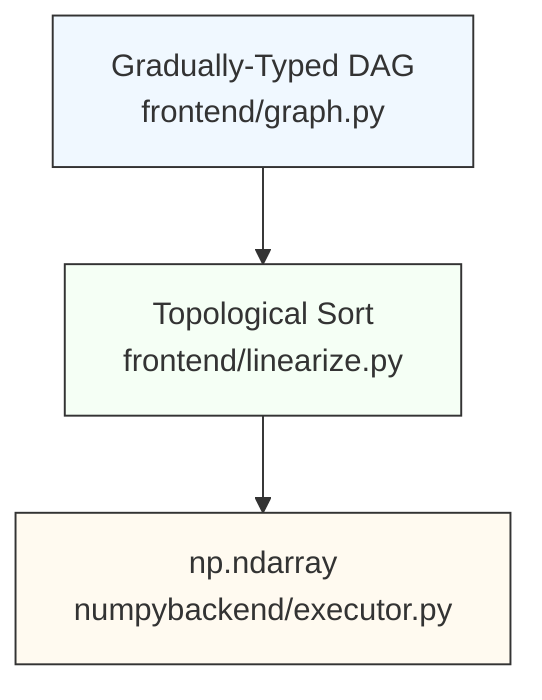

# DSL Compiler Engine

|              | Document data                                  |
|--------------|------------------------------------------------|
| Author       | [@bassosimone](https://github.com/bassosimone) |
| Co-authors   | [@pistore](https://github.com/pistore)         |
| Last-Updated | 2026-02-28                                     |
| Status       | Draft                                          |
| Approved-By  | N/A                                            |

The [dt_model](../../civic_digital_twins/dt_model) package includes
[engine](../../civic_digital_twins/dt_model/engine):
a compiler for an embedded domain specific language (DSL). We use this
DSL to represent computations required to evaluate the satisfiability
of civic-digital-twin models constraints.

(See the [Appendix](#appendix) for a glossary.)

## TL;DR

This section provides a compact introduction to the compiler design
and architecture. Subsequent sections provide a more gentle
introduction to the topic — along with examples — and explain
the design rationale more in detail.

**DSL.** The programmer writes DSL code, either directly or indirectly, i.e.,
using classes defined in the [dt_model](../../civic_digital_twins/dt_model)
package. Each operation in the DSL defines a *node*. The programmer may
add explicit type annotation to nodes. In such a case, a static type
checker, such as [pyright](https://github.com/microsoft/pyright), will
produce static type checking errors when trying to mix nodes having
incompatible types. The errors will be rendered in visual editors as
red error squiggles. Type annotation is optional and gradual. Any unannotated node
is implicitly annotated with the `Unknown` type. Operations involving
nodes using the `Unknown` type *are not* type checked. This allows untyped
DSL code to be written quickly, but disables static checking on
operations involving those nodes.

**Placeholders and Constants.** The DSL allows the programmer to include
scalar constant values (including strings, numbers, and bools) and
placeholders. A placeholder represents a value that will be provided
by the programmer at evaluation time.

**User-Defined Functions.** The DSL allows the programmer to include
nodes representing user-defined functions. Each user-defined function
takes in input an arbitrary number of nodes and produces in output
a single node. When lowering the code to [NumPy](https://github.com/numpy/numpy),
user defined functions are transformed into concrete functions taking
in input zero or more `np.ndarray` and returning a `np.ndarray`.

**DAG.** The written DSL code is as a [directed acyclic graph](
https://en.wikipedia.org/wiki/Directed_acyclic_graph) (DAG).

**Support for Multiple Backends.** The DAG may be evaluated by distinct
backends. Currently, we only implement a [NumPy](https://github.com/numpy/numpy)
backend. However, the code can easily be extended to support other
backends, such as [TensorFlow](https://github.com/tensorflow/tensorflow).
Because of this possibility, the compiler is conceptually split into
a backend-agnostic *frontend* and specific *backends*.

**NumPy Evaluation.** To evaluate a DAG we evaluate its topologically
sorted nodes. The evaluation uses a *State* data structure (functionally
equivalent to a dictionary mapping a node to the `np.ndarray` result of
its evaluation). The evaluation algorithm uses a Python-based interpreter
that maps nodes to the corresponding NumPy operations, reads required node
values from the State, and writes results back to the State. Each node is
evaluated at most once. An experimental JIT compilation strategy using
[Numba](https://github.com/numba/numba) is developed in a separate branch;
see [#54](https://github.com/fbk-most/civic-digital-twins/issues/54).

## End-To-End Example

```Python
import numpy as np

from civic_digital_twins.dt_model.engine.frontend import graph, linearize
from civic_digital_twins.dt_model.engine.numpybackend import executor


# Define types
class TimeDimension:
    """Represents nodes in the time dimension."""


class EnsembleDimension:
    """Represents nodes in the ensemble dimension."""


# Define a type-aware DAG
a = graph.placeholder[TimeDimension]("a")
b = graph.placeholder[TimeDimension]("b")
k0 = graph.constant(3, name="k0")
c = a + b * k0
c1 = graph.function_call("reduce", c)
d = a * k0 - b
d1 = graph.function_call("reduce", d)

# Obtain a topological ordering for the nodes of interest
nodes = linearize.forest(c1, d1)

# Setup initial state including placeholder values
# and the user-defined function `reduce`
state = executor.State(
    values={
        a: np.asarray([100, 10, 1]),
        b: np.asarray([200, 20, 2]),
    },
    functions={
        "reduce": executor.LambdaAdapter(
            lambda n: np.divide(n, np.asarray(5)),
        ),
    },
)

# Evaluate nodes in topological order
executor.evaluate_nodes(state, *nodes)

# Print the results
print(state.get_node_value(c1))
print(state.get_node_value(d1))
```

To observe the program running, save it as `examples/complete.py`
then execute the following commands:

```bash
export DTMODEL_ENGINE_FLAGS=trace
uv run python examples/complete.py
```

This command will trace the evaluation of each node in the
graph using NumPy and produce the computation results. We will
provide more information on the compiler and the tracing
format in the subsequent sections.

## Architecture

The compiler is logically split into a *frontend* and *backends*
specific to the computational library to use. As of 2025-07-30, the
compiler architecture consists of:

1. a [frontend](../../civic_digital_twins/dt_model/engine/frontend)
that deals with a directed acyclic graph (DAG) representing the
computation through Python classes that resembles
[NumPy](https://github.com/numpy/numpy)'s API.

2. a [numpybackend](../../civic_digital_twins/dt_model/engine/numpybackend)
that evaluates the DAG using [NumPy](https://github.com/numpy/numpy).

Additional backends will take the `<backend>backend` name. For example:
`tensorflowbackend`, `jaxbackend`.

## Main Modules: a Quick Reference

| Module | Responsibility |
| ------ | -------------- |
| [`atomic/__init__.py`](../../civic_digital_twins/dt_model/engine/atomic/__init__.py) | Atomic counters. |
| [`compileflags/__init__.py`](../../civic_digital_twins/dt_model/engine/compileflags/__init__.py) | Compile flags definition. |
| [`frontend/graph.py`](../../civic_digital_twins/dt_model/engine/frontend/graph.py) | Node types and gradually-typed DSL. |
| [`frontend/linearize.py`](../../civic_digital_twins/dt_model/engine/frontend/linearize.py) | Topological sorting. |
| [`numpybackend/executor.py`](../../civic_digital_twins/dt_model/engine/numpybackend/executor.py) | Main executor interface. |
| [`numpybackend/numpy_ast.py`](../../civic_digital_twins/dt_model/engine/numpybackend/numpy_ast.py) | Graph-to-NumPy AST translation (debugging). |

## Overall Data Flow



## frontend/graph.py: Writing a DAG

The corresponding module is [frontend/graph.py](../../civic_digital_twins/dt_model/engine/frontend/graph.py).

In principle, end-users should not need to write DAGs by hand. The
examples here are for understanding internals and testing. In production,
DAGs are generated *indirectly* by the
[dt_model](../../civic_digital_twins/dt_model) package.

The following example shows how one could write a simple DSL:

```Python
# Import the `graph` module for manually writing the DAG
from civic_digital_twins.dt_model.engine.frontend import graph

# Define the inputs for the DAG (aka "placeholders").
a = graph.placeholder("a")
b = graph.placeholder("b")

# Define constants used in the DAG. Constants may also be
# specified inline without bothering to create them.
scale = graph.constant(1024)

# Compute a node named `c` using specific operations
c = graph.exp(a) + 55 / a

# Compute a node named `d` using specific operations
d = c * b + scale

# Compute a node named `e` using specific operations
e = graph.power(a, c) * 144
```

This DAG that combines input placeholders (`a` and `b`) and operations (`+`,
`*`, `/`, `graph.exp`, and `graph.power`) to produce specific outputs
(`c`, `d`, and `e`). Please, feel encouraged to create a file named
`examples/design.py` to try for yourself the examples in this tutorial. To
run the file, use `uv run python examples/design.py`.

To enable optional static type checking of DSL graphs, you
can annotate nodes with types using Python's generics syntax. This
way you will know if you're mixing "apples and oranges". For
example, you could write the following:

```Python
# ...


class Apple:
    """Represent apples."""


class Orange:
    """Represent oranges."""


# Explicitly say that the placeholders are oranges
a = graph.placeholder[Orange]("a")
b = graph.placeholder[Orange]("b")

# Explicitly say that the constants are oranges
scale = graph.constant[Orange](1024)

# ...
```

This ensures that static type checkers, such as
[pyright](https://github.com/microsoft/pyright), produce
static type errors — rendered as squiggles by editors
such as VSCode — when mixing apples and oranges. For example,
the following code mixes incompatible types:

```Python
# ...

# Explicitly say that the placeholders are oranges
a = graph.placeholder[Orange]("a")
b = graph.placeholder[Orange]("b")

# Oops, scale is now an apple and not an orange!
scale = graph.constant[Apple](1024)

# ...

# This line produces static typing errors because the
# operation is mixing apples and oranges.
d = c * b + scale
```

In practice, assigning distinct types to distinct nodes is
beneficial to avoid programming mistakes, especially with
shapes. For example, a real model could have the ensemble
dimension with shape `(1,)` and the time dimension with
shape `(255,)`. To perform computations in the time-ensemble
dimension, one needs to expand vectors into the `(255,1)`
space. By using types correctly, we avoid mixing dimensions
and reduce the risk of combining nodes with incorrect
shapes by mistake.

Regarding how `graph.py` could be implemented, a very simplified
implementation looks like this:

```Python
# === Extremely simplified `graph.py` implementation (illustrative only) ===


class Node(Generic[T]):
    def __init__(self, name: str) -> None:
        self.name = name

    def __add__(self, other: Node[T]) -> Node[T]:
        return add(self, other)

    # ...


class placeholder(Generic[T], Node[T]):
    def __init__(self, name: str) -> None:
        super.__init__(name)


class constant(Generic[T], Node[T]):
    def __init__(self, value: int | float, name: str = "") -> None:
        super.__init__(name)
        self.value = value


class add(Generic[T], Node[T]):
    def __init__(self, left: Node[T], right: Node[T], name: str = "") -> None:
        super.__init__(name)
        self.left = left
        self.right = right

# ...
```

Basically:

1. We define a generic node and reimplement all the special
operations such as `__add__` so that we can write `a + b` where
`a` and `b` are nodes to obtain an `add` instance.

2. Inputs (i.e., `constant` and `placeholder`) just hold the
related name and value of the node.

3. Operations are nodes that refer to their operands.

Note that we use lowercase names for classes
(a [PEP8](https://peps.python.org/pep-0008/) violation)
because we want names compatible with NumPy (e.g., we want
`graph.add` to correspond to `np.add`).

Additionally, the `graph.function_call` node allows to create
a node that will call a user-defined function. For example:

```Python
# ...

f = graph.function_call("reduce", c, d, e)
```

The programmer will need to supply at evaluation time an
implementation of reduce that looks like this:

```Python
def reduce(c: np.ndarray, d: np.ndarray, e: np.ndarray) -> np.ndarray: ...
```

In the next section, we will start to play around to understand
what is the structure of this DAG that we have created.

### Timeseries Nodes

In addition to scalar `constant` and `placeholder`, `graph.py` provides
two nodes for representing time-indexed data:

- **`graph.timeseries_constant(values, name="")`** — stores a fixed 1-D
  array of values (one per time step).  At evaluation time the executor
  converts it to a `np.ndarray` of the corresponding shape.

- **`graph.timeseries_placeholder(name)`** — a placeholder whose value
  is a 1-D array supplied at evaluation time (e.g. a measured time-series).

Example:

```Python
import numpy as np
from civic_digital_twins.dt_model.engine.frontend import graph

# A fixed time series (e.g. 24 hourly demand values)
demand = graph.timeseries_constant(np.arange(24, dtype=float), "demand")

# A placeholder for an externally supplied time series
traffic = graph.timeseries_placeholder("traffic")

# Formulas can combine timeseries nodes with scalar nodes
scaled = demand * graph.constant(0.5)
```

The executor evaluates timeseries nodes in the same way as scalar nodes;
the difference is purely in the shape of the resulting `np.ndarray`.

### Axis Management

`graph.py` provides four operations for reshaping arrays produced by other
nodes.  These are essential when combining values that live in different
broadcast dimensions (e.g. scalar model parameters versus multi-dimensional
evaluation grids).

| Operation | Description |
| --------- | ----------- |
| `graph.project_using_sum(node, axis=-1)` | Reduce `node` along `axis` by summing; the reduced axis is *preserved* as size 1 (keepdims semantics). |
| `graph.project_using_mean(node, axis=-1)` | Same as above but using the mean. |
| `graph.expand_dims(node, axis)` | Insert a new size-1 axis at position `axis` (equivalent to `np.expand_dims`). |
| `graph.squeeze(node, axis)` | Remove the size-1 axis at position `axis` (equivalent to `np.squeeze`). |

`GenericIndex.sum(axis=-1)` and `GenericIndex.mean(axis=-1)` are convenience
wrappers that delegate to `project_using_sum` and `project_using_mean`
respectively, and are the recommended way to use these operations at the
model layer.

> **Note on `project_using_sum` / `project_using_mean` semantics.**
> Both operations always preserve the reduced axis as a size-1 dimension.
> Callers that previously relied on axis *collapsing* (the 0.5.0 default)
> must now use `np.squeeze` or `graph.squeeze` on the result.

## Printing DAG Nodes

Once we have a DAG, we can dump its internal representation by
using `print` on each node in the DAG.

For example, `print(a)` produces the following output:

```Python
n1 = graph.placeholder(name='a', default_value=None)
```

As you can see, a node's string representation is valid Python
code. This is done on purpose. Nodes (and trees), when formatted
to string, produce the code they correspond to.

Let us now check more in detail the meaning of the printed code:

1. we are assigning to `n1` to indicate that the relevant
node is associated with the unique ID `1` (each node is
assigned a unique ID when it is created using the `engine/atomic`
package).

2. `graph.placeholder` is the node type constructor.

3. `name="a"` indicates that the placeholder name is `a`.

4. `default_value=None` indicates that there is no default
value associated with the placeholder.

Similarly, `print(scale)` produces the following output:

```Python
n3 = graph.constant(value=1024, name='')
```

So far, we have dumped constants and placeholders, which are
simple to understand. If we `print(c)`, instead, we get:

```Python
n7 = graph.add(left=n4, right=n6, name='c')
```

This tells us that `c` corresponds to a node with ID `7` that
performs the sum of nodes `4` and `6`. However, we cannot
see nodes `4` and `6` just by dumping `c`. To see what it means
to compute `c`, we need topological sorting, which is the
topic covered by the next section.

By the way, this code-like representation of a node where we have:

```
<targetNode> = <operation>(<operandNodes>)
```

is called [Static-Single-Assignment (SSA) form](https://en.wikipedia.org/wiki/Static_single-assignment_form).

## frontend/linearize.py: Topological Sorting

[Topological sorting](https://en.wikipedia.org/wiki/Topological_sorting)
means producing a linear "plan" to compute a given node.

The corresponding module is [frontend/linearize.py](../../civic_digital_twins/dt_model/engine/frontend/linearize.py).

Let us use `linearize.forest` to produce a topological sorting for `c`:

```Python
# ...

# Let's import the linearize module
from civic_digital_twins.dt_model.engine.frontend import linearize

# Let's generate the plan for producing `c`
plan = linearize.forest(c)

# Let's print all the related nodes in evaluation order
for node in plan:
    print(node)
```

(The operation is called `linearize.forest` because it takes in
input multiple tree roots — e.g., `linearize.forest(a, b, c)` — thus
linearizing a forest of trees embedded into the DAG.)

This is the output that we get:

```Python
n1 = graph.placeholder(name='a', default_value=None)
n4 = graph.exp(node=n1, name='')
n5 = graph.constant(value=55, name='')
n6 = graph.divide(left=n5, right=n1, name='')
n7 = graph.add(left=n4, right=n6, name='')
```

This plan basically tells us that to produce `c`, which is
`n7` (i.e., the node with ID equal to `7`):

1. we need the `n1` placeholder node.

2. we compute the `exp` of `n1` and assign to `n4`

3. we need the constant `55` as `n5`.

4. we perform `n5 / n1` and assign to `n6`.

5. we perform `n4 + n6` and assign to `n7` (our result).

Note that the above representation is just a more verbose
way of writing the original code:

```Python
a = graph.placeholder("a")
c = graph.exp(a) + 55 / a
```

Also, note that when we perform a topological sorting targeting
`c`, we only see the relevant DAG nodes. This makes sense because
we are basically selecting the subgraph tree rooted in `c`.

With topological sorting, we have a powerful and sufficient way of transforming
a DAG into an actionable sequence of operations that the executor can evaluate
step by step.

## numpybackend/executor.py: NumPy Evaluator Interface

The [numpybackend/executor.py](../../civic_digital_twins/dt_model/engine/numpybackend/executor.py)
module evaluates a sequence of topologically sorted graph nodes and produces numeric results.

The `executor` is associated with a *State* data structure that maps each
`graph.Node` to its `np.ndarray` result.  A barebone implementation looks like:

```Python
# === Extremely simplified executor implementation (illustrative only) ===

# Define the empty state
state: dict[graph.Node, np.ndarray] = {}

# Assign the placeholder values
state[a] = np.asarray(4)
state[b] = np.asarray(2)

# Define the evaluator function
def evaluate_nodes(state: dict[graph.Node, np.ndarray], *nodes: graph.Node) -> None:
    for node in nodes:

        # compute each node at most once
        if node in state:
            continue

        # execute the proper action depending on the node type
        if isinstance(node, graph.add):
            state[node] = np.add(state[node.left], state[node.right])
            continue

        # ...
```

In terms of the *actual* usage, the following code illustrates
how you can use the executor in your code:

```Python
# ...

from civic_digital_twins.dt_model.engine.frontend import linearize
from civic_digital_twins.dt_model.engine.numpybackend import executor

import numpy as np

# create state with placeholder values
state = executor.State(
    values={
        a: np.asarray(4),
        b: np.asarray(2),
    }
)

# obtain a topological ordering covering the nodes of interest
nodes = linearize.forest(c, d, e)

# evaluate all nodes in order
executor.evaluate_nodes(state, *nodes)

# print the "d" result
print(state.get_node_value(d))
```

This code runs an implementation *conceptually* similar to the
one we described above. In compiler terms, this is an interpreter,
written in Python, using node-indexed memory locations (i.e.,
the state) to remember values and make them available to
subsequent operations. We evaluate nodes *at most once* to
avoid performing redundant work. If you need to re-evaluate
a model, you should start from an empty state. However, note
that you can prepopulate the state, if that's needed. Basically,
the current state represents the memory snapshot after the
evaluation of all the nodes evaluated so far.

## Tracing execution with `DTMODEL_ENGINE_FLAGS`

The `DTMODEL_ENGINE_FLAGS` environment variable allows to
automatically trace the execution. So, for example, if you
saved your program as `example/basic.py`, the following
`bash` commands:

```bash
export DTMODEL_ENGINE_FLAGS=trace
uv run python example/basic.py
```

Produces the following output:

```Python
# n1 = graph.placeholder(name='a', default_value=None)
n1 = np.asarray(4)
# shape: ()
# dtype: int64
# value:
# 4

# n2 = graph.placeholder(name='b', default_value=None)
n2 = np.asarray(2)
# shape: ()
# dtype: int64
# value:
# 2

# n3 = graph.constant(value=1024, name='')
n3 = np.asarray(1024)
# shape: ()
# dtype: int64
# value:
# 1024

# n5 = graph.constant(value=55, name='')
n5 = np.asarray(55)
# shape: ()
# dtype: int64
# value:
# 55

# n11 = graph.constant(value=144, name='')
n11 = np.asarray(144)
# shape: ()
# dtype: int64
# value:
# 144

# n4 = graph.exp(node=n1, name='')
n4 = np.exp(n1)
# shape: ()
# dtype: float64
# value:
# 54.598150033144236

# n6 = graph.divide(left=n5, right=n1, name='')
n6 = np.divide(n5, n1)
# shape: ()
# dtype: float64
# value:
# 13.75

# n7 = graph.add(left=n4, right=n6, name='')
n7 = np.add(n4, n6)
# shape: ()
# dtype: float64
# value:
# 68.34815003314424

# n10 = graph.power(left=n1, right=n7, name='')
n10 = np.power(n1, n7)
# shape: ()
# dtype: float64
# value:
# 1.4115186353908455e+41

# n12 = graph.multiply(left=n10, right=n11, name='')
n12 = np.multiply(n10, n11)
# shape: ()
# dtype: float64
# value:
# 2.0325868349628174e+43

# n8 = graph.multiply(left=n7, right=n2, name='')
n8 = np.multiply(n7, n2)
# shape: ()
# dtype: float64
# value:
# 136.69630006628847

# n9 = graph.add(left=n8, right=n3, name='')
n9 = np.add(n8, n3)
# shape: ()
# dtype: float64
# value:
# 1160.6963000662886
```

Note that the output is valid Python code (you just need to add `import numpy as np`
at the top to make the script valid). For each node, we print:

1. a comment showing the actual node;
2. valid Python code showing the equivalent NumPy operation;
3. the shape, dtype, and value as comments.

Note that we use `np.asarray` to create constants and placeholders.

## More `DTMODEL_ENGINE_FLAGS` goodies

The `DTMODEL_ENGINE_FLAGS` allows to set compiler
flags using an environment variable. However, you can also
set flags programmatically. For example, you can take advantage
of `compileflags.BREAK` to stop the execution *after* a node has
been evaluated:

```Python
# ...

# import the compileflags package to get flags values
from civic_digital_twins.dt_model.engine import compileflags

flags: int = 0
flags |= compileflags.TRACE  # print each node and its value
flags |= compileflags.BREAK  # stop after evaluating a node

# create state with placeholder values
state = executor.State(
    values={
        a: np.asarray(4),
        b: np.asarray(2),
    },
    flags=flags,
)

# ...
```

## User-Defined Functions

Use the `numpybackend.executor.LambdaAdapter` to wrap an
ordinary Python `lambda` and register a user-defined function.

The following code shows some usage examples:

```Python
import numpy as np

from civic_digital_twins.dt_model.engine.frontend import graph, linearize
from civic_digital_twins.dt_model.engine.numpybackend import executor

# Define just two constants to operate on
k0 = graph.constant(100)
k1 = graph.constant(50)
k2 = graph.constant(117)
k3 = graph.constant(1000)

# Call a function that takes arguments in positional order
scaled1 = graph.function_call("scale1", k0, k1)

# Call a function that takes keyword arguments
scaled2 = graph.function_call("scale2", k0=k0, k1=k1)

# Call a function that takes a mixture of arguments
scaled3 = graph.function_call("scale3", k0, k1, k2=k2, k3=k3, scaled2=scaled2)

# Obtain a topological ordering for the nodes of interest
nodes = linearize.forest(scaled1, scaled2, scaled3)

# Initialize the evaluation state
state = executor.State(
    values={},
    functions={
        "scale1": executor.LambdaAdapter(
            lambda k0, k1: np.add(k0, k1),
        ),
        "scale2": executor.LambdaAdapter(
            lambda **kwargs: np.add(kwargs["k0"], kwargs["k1"]),
        ),
        "scale3": executor.LambdaAdapter(
            lambda k0, k1, **kwargs: np.add(
                k0, np.add(k1, np.add(kwargs["k2"], np.add(kwargs["k3"], kwargs["scaled2"])))
            ),
        ),
    },
)

# Evaluate the nodes in order
executor.evaluate_nodes(state, *nodes)

# Print the results
print(f"#{state.get_node_value(scaled1)}")
print(f"#{state.get_node_value(scaled2)}")
print(f"#{state.get_node_value(scaled3)}")
```

Executing this code with `export DTMODEL_ENGINE_FLAGS=trace`
produces the following output:

```Python
# n1 = graph.constant(value=100, name='')
n1 = np.asarray(100)
# shape: ()
# dtype: int64
# value:
# 100

# n2 = graph.constant(value=50, name='')
n2 = np.asarray(50)
# shape: ()
# dtype: int64
# value:
# 50

# n3 = graph.constant(value=117, name='')
n3 = np.asarray(117)
# shape: ()
# dtype: int64
# value:
# 117

# n4 = graph.constant(value=1000, name='')
n4 = np.asarray(1000)
# shape: ()
# dtype: int64
# value:
# 1000

# n5 = graph.function_call(name='scale1', n1, n2)
n5 = scale1(n1, n2)
# shape: ()
# dtype: int64
# value:
# 150

# n6 = graph.function_call(name='scale2', k0=n1, k1=n2)
n6 = scale2(k0=n1, k1=n2)
# shape: ()
# dtype: int64
# value:
# 150

# n7 = graph.function_call(name='scale3', n1, n2, k2=n3, k3=n4, scaled2=n6)
n7 = scale3(n1, n2, k2=n3, k3=n4, scaled2=n6)
# shape: ()
# dtype: int64
# value:
# 1417

#150
#150
#1417
```

## Error Handling

- The topological sorting algorithm will detect cycles
in the DAG and throw an exception in such a case.

- We assume that shapes and dtypes match. We expect static
type checking to help avoiding such mistakes. Yet, in case
of mismatches NumPy will throw at runtime.

- Evaluating a tree whose input nodes have not been evaluated
yet causes an exception to be throw by the evaluator.

## Testing Strategy

All the compiler code SHOULD have 100% coverage. It is foundational
code upon which the research code depends. We should aim to be
confident that each line is executed at least once and does not crash.
Also, we SHOULD have tests in place ensuring that a graph produces the same
numerical result of the equivalent NumPy code. (As of 2025-07-14,
this is currently the case, yay!)

## Future Work

- We lack a mechanism for profiling the evaluation of individual trees,
which could guide decisions regarding the correct partitioning as
well as on whether to use Numba.

## Conclusion

The compiler provides a complete pipeline: representing computations as a
gradually-typed DAG, linearising the DAG via topological sorting, and
evaluating the resulting sequence of nodes with a Python-based NumPy interpreter.
This design enables debuggability (via `DTMODEL_ENGINE_FLAGS=trace`),
extensibility (user-defined functions via `function_call`), and a clean
separation between the frontend DSL and the NumPy backend.  An experimental
JIT compilation path using Numba is tracked in
[#54](https://github.com/fbk-most/civic-digital-twins/issues/54).

## Appendix

### Glossary

**DAG**: [Directed-acyclic graph](https://en.wikipedia.org/wiki/Directed_acyclic_graph) of connected nodes.

**JIT**: Just in Time compilation. When `@numba.njit` functions
are invoked, the first execution generates and caches machine code
for arrays of the given shape. Machine code customized to the
shape is more efficient than generic NumPy code.

**Node**: An operation or value in the computation graph.

**Placeholder**: A symbolic node to be assigned a value at runtime.

**Root**: The root of a tree.

**State**: The runtime memory used during evaluation, mapping each
`graph.Node` to its computed value (`np.ndarray`).

**Tree**: A topologically sorted subgraph rooted at a node,
including all nodes required to compute it.

**User-Specified Function**: Function taking in input `np.ndarray`s
and returning `np.ndarray` that can be called indirectly when
building the tree as long as the function implementation is provided
when we are evaluating the DAG.
