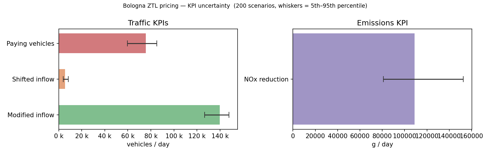
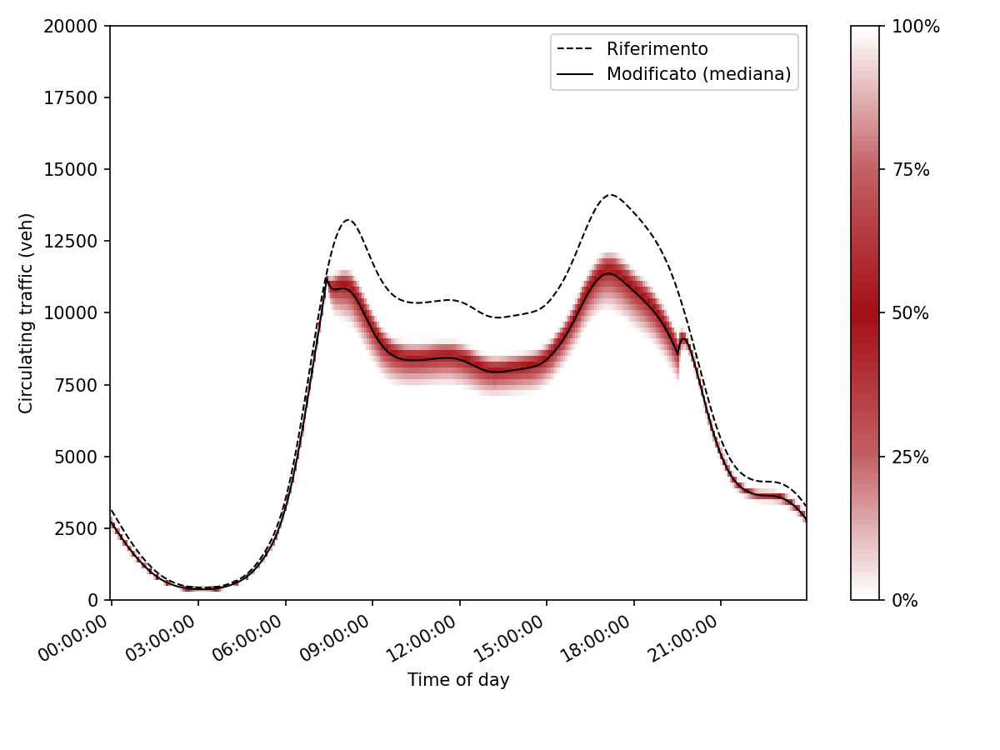
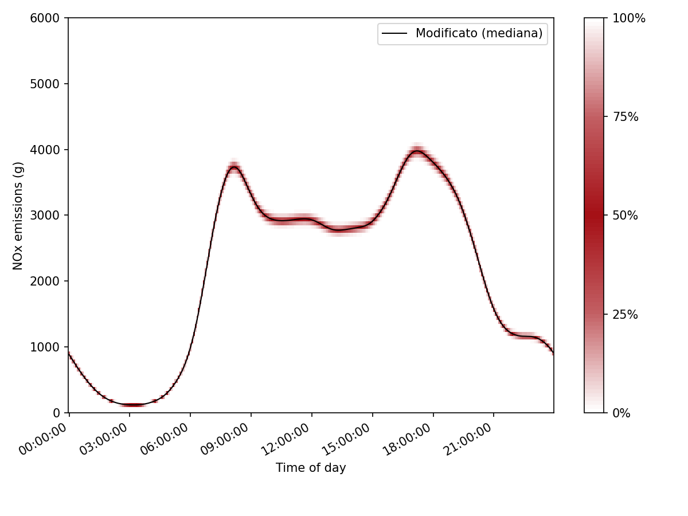

<!-- _class: lead -->
<!-- _paginate: false -->

# Civic Digital Twins
## The CDT Modelling Framework

*IO Contracts · Modularity · Model Variants*

<br>

**Marco Pistore** · MOST · Fondazione Bruno Kessler
**Claude Sonnet 4.6** · Anthropic

---

<!-- _footer: "Introduction" -->

## What this seminar covers

The **Civic Digital Twins (CDT)** library is a Python framework for building structured, modular models of civic systems.

**Goal:** show how to define models that are *typed*, *composable*, and *easy to swap*.

Four key concepts:
- **Indexes** — typed, lazily-evaluated quantities: constants, formulas, timeseries, probability distributions
- **IO Contracts** — typed interfaces between sub-models (`Inputs`, `Outputs`, `Expose`)
- **Modularity** — each conceptual stage is an independent, testable sub-model
- **Model Variants** — swap formulations or computation engines without touching downstream code

All concepts are illustrated through a single running example: **Bologna city-centre road pricing (ZTL)**.
The framework generalises to any civic domain — mobility, energy, water, healthcare.

---

<!-- _footer: "Introduction" -->

## Outline

| | Part | Topics |
|---|---|---|
| **0** | Motivating example | Bologna scenario, KPIs, model pipeline |
| **1** | CDT Framework Basics | Indexes, distributions, simulation |
| **2** | IO Contracts | Inputs, Outputs, Expose, warnings |
| **3** | Modularity | Constructor wiring, sub-models |
| **4** | Model Variants | Formulations, engines, `ModelVariant` |
| **5** | Putting it all together | Results, summary, roadmap |

---

<!-- _class: section-header -->

# Part 0 — Motivating Example
## Bologna City-Centre Road Pricing

---

<!-- _footer: "Part 0 — Motivating Example" -->

## The Bologna mobility example

**Setting:** Bologna city centre — a *Zona a Traffico Limitato* (ZTL)

- ≈ 400 000 vehicle entries per day
- Fleet composed of Euro 0 – Euro 6 vehicles
- Each Euro class carries a different NOx emission factor

**Hypothetical policy under study:** road pricing

- Vehicles pay a per-entry fee (as in London or Milan), graduated by Euro class
- Higher-polluting vehicles pay more → expected to reduce entries
- Some drivers *anticipate* (enter before the window), some *postpone*

**Question:** given the pricing parameters, what are the effects on traffic volume and NOx emissions?

---

<!-- _footer: "Part 0 — Motivating Example" -->

## What we want to compute

Three families of KPIs:

| KPI | Unit |
|-----|------|
| Modified vehicle inflow | veh / day |
| Shifted inflow (anticipating + postponing) | veh / day |
| NOx emissions — base vs. modified | g / day |

<br>

All KPIs depend on **behavioural parameters** that are not known precisely: price-elasticity, anticipation probability, postponement duration.

In this example, we model the **price-elasticity threshold** as a random variable (uniform over [4 €, 11 €]) and run the model over an **ensemble of scenarios** sampled from that distribution. Other parameters could be made uncertain in the same way.

---

<!-- _footer: "Part 0 — Motivating Example" -->

## How we will model it

Each stage of the computation becomes its own sub-model:

```
  vehicle data  +  policy parameters
                │
                ▼
      ┌─────────────────────┐
      │     InflowModel     │  How does pricing change vehicle entries?
      └──────────┬──────────┘
                 │  modified inflow · modified fleet mix
                 ▼
      ┌─────────────────────┐
      │    TrafficModel     │  What is the circulating traffic?
      └──────────┬──────────┘
                 │  traffic timeseries (base + modified)
                 ▼
      ┌─────────────────────┐
      │   EmissionsModel    │  What are the NOx emissions?
      └──────────┬──────────┘
                 │  KPI outputs
                 ▼
      ┌─────────────────────┐
      │    BolognaModel     │  Root — wires the three stages
      └─────────────────────┘
```

---

<!-- _class: section-header -->

# Part 1 — CDT Framework Basics

*Indexes · Models · Evaluation*

---

<!-- _footer: "Part 1 — Basics" -->

## The framework in three layers

```
  ┌──────────────────────────────────────────────────────┐
  │  Model layer                                         │
  │  Index · TimeseriesIndex · DistributionIndex         │
  │  → domain quantities; what you write                 │
  ├──────────────────────────────────────────────────────┤
  │  Simulation layer                                    │
  │  DistributionEnsemble · Evaluation · EvaluationResult│
  │  → sample → evaluate → aggregate                     │
  ├──────────────────────────────────────────────────────┤
  │  Engine layer                                        │
  │  computation graph · topological sort · NumPy        │
  │  → how computations are actually run                 │
  └──────────────────────────────────────────────────────┘
```

As a modeller you work almost entirely in the **model** and **simulation** layers. The engine is largely invisible.

---

<!-- _footer: "Part 1 — Basics" -->

## Indexes — the atoms of a model

Every quantity in the model is an **`Index`**:

```python
# A known constant
entry_fee = Index("entry fee euro_0", 5.00)

# A formula — built lazily; evaluated later
avg_fee = Index("average fee", entry_fee * 0.30 + ...)

# A timeseries — one value per time step
inflow = TimeseriesIndex("vehicle inflow", np.array([...]))

# An uncertain parameter — sampled at evaluation time
cost_threshold = DistributionIndex(
    "price-elasticity threshold",
    stats.uniform, {"loc": 4.0, "scale": 7.0},
)
```

Arithmetic operators (`+`, `*`, `/`, …) build a **lazy computation graph**. Nothing is evaluated until `Evaluation.evaluate()` is called.

---

<!-- _footer: "Part 1 — Basics" -->

## Uncertain parameters: `DistributionIndex`

Some parameters are **not known precisely** — they are estimated from surveys, field data, or expert judgment.

A `DistributionIndex` represents such a parameter as a **probability distribution**. Instead of a single model run, we draw many samples and run a scenario for each one.

```python
# Price-elasticity threshold: we believe it lies between 4 € and 11 €
cost_threshold = DistributionIndex(
    "price-elasticity threshold",
    stats.uniform, {"loc": 4.0, "scale": 7.0},
)
```

The result of the simulation is no longer a single number — it is a **distribution of outcomes**, one per scenario. The final KPI is the **expected value** (weighted mean) across all scenarios. Any `Index` formula that depends on `cost_threshold` automatically inherits its uncertainty.

---

<!-- _footer: "Part 1 — Basics" -->

## Running a simulation

```python
# 1. Build the model
model = BolognaModel()

# 2. Draw 200 samples from the uncertain parameters
ensemble = DistributionEnsemble(model, size=200)

# 3. Evaluate — one model run per scenario
result = Evaluation(model).evaluate(ensemble)

# 4. result[idx]  → one value per scenario
#    result.marginalize(idx) → expected value (weighted mean)

emissions = result[model.outputs.total_emissions]
# emissions is a collection of 200 values, one per scenario

expected_emissions = result.marginalize(model.outputs.total_emissions)
# expected_emissions is a single number: E[NOx emissions]
```

The same `evaluate()` call handles both certain and uncertain parameters — no special casing needed.

---

<!-- _footer: "Part 1 — Basics" -->

## KPI output — uncertainty matters

*200-scenario ensemble; price-elasticity threshold ~ Uniform(4 €, 11 €)*

<div class="columns">
<div>

| KPI | Mean | 5th – 95th pct |
|-----|------|----------------|
| Base inflow     | 168 139 veh/d |  —              |
| Modified inflow | 139 720 veh/d |  126 k – 148 k  |
| Shifted inflow  |   5 620 veh/d |    4 k –   8 k  |
| NOx reduction   | 108 857 g/d   |   81 – 153 kg/d |

Reporting only the mean would hide the fact that the NOx reduction estimate spans a **~2× range** depending on the unknown price-elasticity parameter.

</div>
<div>



</div>
</div>

---

<!-- _footer: "Part 1 — Basics" -->

## The problem with a flat model

Without structure, a model is just a bag of indexes:

```python
model = Model("Bologna", [
    inflow, starting,
    start_time, end_time,
    entry_fee_euro0, entry_fee_euro1, ...,   # 7 fee indexes
    cost_threshold,                           # the uncertain parameter
    fraction_rigid_euro0, ...,               # 7 rigidity indexes
    fraction_rigid,
    modified_inflow, modified_starting,
    traffic, modified_traffic, traffic_ratio,
    avg_emissions, emissions, modified_emissions,
    total_emissions, total_modified_emissions,
    # ... 60+ indexes total
])
```

**Three questions with no answer:**
- Which indexes are *inputs*? Which are *outputs*?
- How do you test the traffic computation in isolation?
- How do you replace the emissions formula without touching everything?

---

<!-- _class: section-header -->

# Part 2 — IO Contracts

*Inputs · Outputs · Expose · Warnings*

---

<!-- _footer: "Part 2 — IO Contracts" -->

## From flat lists to structured interfaces

Declare **what a sub-model needs** and **what it produces** as inner `@dataclass` classes:

```python
class InflowModel(Model):

    @dataclass
    class Inputs:
        inflow:          TimeseriesIndex   # raw vehicle inflow
        starting:        TimeseriesIndex   # vehicles starting in ZTL
        entry_fee:       list[Index]       # pricing schedule (per Euro class)
        cost_threshold:  DistributionIndex # price-elasticity ← uncertain

    @dataclass
    class Outputs:
        modified_inflow:   Index   # inflow after policy effect
        modified_starting: Index
        total_paying:      Index   # number of paying vehicles
        avg_cost:          Index   # average fee paid
        ...
```

The model's index list is derived **automatically** from `Inputs` and `Outputs` — no flat list to maintain.

---

<!-- _footer: "Part 2 — IO Contracts" -->

## What InflowModel computes

The core domain formulas (simplified):

```python
# Fraction of vehicles that cannot shift their trip (price-inelastic)
fraction_rigid = Index(
    "rigid vehicles fraction",
    (1 - exempted) * exp(-entry_fee / cost_threshold * log(2)),
)

# Euro-class mix shifts: rigid + exempt vehicles keep their class;
# flexible vehicles may switch to a cleaner class
modified_fleet_mix = [
    Index(f"modified share euro_{e}", ...) for e in range(7)
]

# Modified inflow: rigid + vehicles that were anticipating / postponing
modified_inflow   = Index("modified inflow",   ...)
modified_starting = Index("modified starting", ...)

# Payment statistics
total_paying = Index("total paying vehicles",    ...)
avg_cost     = Index("average cost per vehicle", ...)
```

---

<!-- _footer: "Part 2 — IO Contracts" -->

## Structure of `InflowModel.__init__`

Every `Model.__init__` follows the same three-step pattern:

```python
def __init__(self, inflow, starting, entry_fee, cost_threshold, ...) -> None:

    # Step 1 — pack all constructor arguments into the Inputs dataclass
    inputs = InflowModel.Inputs(
        inflow=inflow,
        entry_fee=entry_fee,
        cost_threshold=cost_threshold,
        ...
    )

    # Step 2 — build the computation graph (lazy; not evaluated yet)
    fraction_rigid  = Index("rigid fraction", ...)
    modified_inflow = Index("modified inflow", ...)
    total_paying    = Index("total paying", ...)
    ...

    # Step 3 — declare the stable public contract
    super().__init__(
        "Inflow",
        inputs=inputs,
        outputs=InflowModel.Outputs(
            modified_inflow=modified_inflow,
            total_paying=total_paying,
            ...
        ),
    )
```

---

<!-- _footer: "Part 2 — IO Contracts" -->

## Three levels of visibility

| Level | How to access | Stability | Can be wired into another model? |
|-------|---------------|-----------|----------------------------------|
| **1 — Contractual** | `model.outputs.*` / `model.inputs.*` | Stable across versions | ✅ Yes |
| **2 — Inspectable** | `model.expose.*` | May change | ❌ No |
| **3 — Internal** | local variables in `__init__` | Not accessible | — |

<br>

**Level 1** is the interface contract — the only safe wiring point.

**Level 2** (`Expose`) surfaces intermediate quantities useful for plotting or debugging, without making them part of the contract.

**Level 3** exists only inside the engine graph — invisible from outside.

---

<!-- _footer: "Part 2 — IO Contracts" -->

## `Expose` — diagnostics, never wiring

```python
@dataclass
class Expose:
    fraction_anticipating: TimeseriesIndex  # for time-of-day plot
    number_anticipating:   TimeseriesIndex
    number_postponing:     TimeseriesIndex
    ...  # 16 diagnostic fields in InflowModel
```

```python
inflow = InflowModel(...)

# ✅ Reading for a plot — fine
frac = inflow.expose.fraction_anticipating

# ❌ Passing to another model — forbidden
bad = TrafficModel(anticipating=inflow.expose.fraction_anticipating)
```

The rule is simple: **`Expose` is for reading, never for wiring.** Field names in `Expose` may change between versions without notice.

---

<!-- _footer: "Part 2 — IO Contracts" -->

## `InputsContractWarning` — catching wiring mistakes

Every `GenericIndex` passed as a constructor argument **must** appear in `Inputs`. If it does not, a warning fires at construction time:

```
InputsContractWarning: InflowModel: parameter 'cost_threshold'
holds a GenericIndex not declared in Inputs. Add it as a field
of InflowModel.Inputs and include it in inputs=... passed to
super().__init__().
```

The warning is **soft** — execution continues — so existing models can be migrated incrementally. Harden it in CI with one line:

```python
warnings.filterwarnings("error", category=ModelContractWarning)
```

---

<!-- _footer: "Part 2 — IO Contracts" -->

## What IO contracts give you

- **Clarity** — the `Inputs` / `Outputs` dataclasses *are* the documentation. A reader understands the interface without tracing through the formula definitions.

- **Safety** — wiring mistakes (`Expose` used as input, undeclared parameter, broken cross-variant contract) are caught at **construction time**, not at evaluation time.

- **Testability** — each sub-model is a plain Python object. Build it with stub indexes and inspect its outputs directly:

```python
inflow = InflowModel(inflow=stub_ts, entry_fee=fixed_fees,
                     cost_threshold=DistributionIndex(...), ...)

assert inflow.outputs.modified_inflow is not None
assert inflow.outputs.total_paying    is not None
assert inflow.is_instantiated() is False   # cost_threshold is still abstract
```

---

<!-- _class: section-header -->

# Part 3 — Modularity

*Constructor wiring · Pipeline · Root model*

---

<!-- _footer: "Part 3 — Modularity" -->

## Why decompose?

A monolithic `__init__` with 60+ indexes is:

- **Unreadable** — no screen fits it; boundaries between concerns are invisible
- **Untestable** — the traffic computation cannot be isolated from the inflow computation
- **Rigid** — replacing the emissions formula means reading and modifying hundreds of lines

The solution: each **conceptual stage** becomes its own `Model` subclass, receiving its upstream results as **typed constructor arguments**.

---

<!-- _footer: "Part 3 — Modularity" -->

## Constructor wiring — the pattern

Sub-models are constructed **inside the root's `__init__`** and never stored on `self`. Only their **output index objects** are threaded forward.

```python
class BolognaModel(Model):
    def __init__(self) -> None:

        # Leaf-level inputs created here
        inflow         = TimeseriesIndex("vehicle inflow", vehicle_inflow)
        cost_threshold = DistributionIndex("price-elasticity", ...)
        ...

        # Stage 1
        _inflow = InflowModel(inflow=inflow, cost_threshold=cost_threshold, ...)

        # Stage 2 — wired to Stage 1 outputs
        _traffic = TrafficModel(
            inflow=inflow,
            modified_inflow=_inflow.outputs.modified_inflow,     # ← contractual output
            modified_starting=_inflow.outputs.modified_starting, # ← contractual output
        )

        # Stage 3 — wired to outputs of both Stage 1 and Stage 2
        _emissions = EmissionsModel(
            traffic=_traffic.outputs.traffic,                     # ← contractual output
            modified_traffic=_traffic.outputs.modified_traffic,   # ← contractual output
            modified_fleet_mix=_inflow.outputs.modified_fleet_mix, # ← contractual output
            ...
        )
```

---

<!-- _footer: "Part 3 — Modularity" -->

## `TrafficModel`

Receives the policy-modified inflow from `InflowModel` and computes steady-state circulating traffic for both the base and modified scenarios.

```python
class TrafficModel(Model):

    @dataclass
    class Inputs:
        inflow:            TimeseriesIndex
        starting:          TimeseriesIndex
        modified_inflow:   Index
        modified_starting: Index

    @dataclass
    class Outputs:
        traffic:                TimeseriesIndex  # base circulating traffic
        modified_traffic:       TimeseriesIndex  # policy-modified traffic
        total_modified_traffic: Index
        traffic_ratio:          Index            # modified / base
        ...

    def __init__(self, inflow, starting, modified_inflow, modified_starting):
        ...
        traffic          = TimeseriesIndex("traffic",
                               inflow + starting)           # simplified: direct sum — wrong approximation
        modified_traffic = TimeseriesIndex("modified traffic",
                               modified_inflow + modified_starting)  # simplified: same
        ...
```

---

<!-- _footer: "Part 3 — Modularity" -->

## `EmissionsModel` wiring

`EmissionsModel` receives outputs from **both** upstream stages:

```python
_emissions = EmissionsModel(
    traffic=_traffic.outputs.traffic,                   # ← from TrafficModel
    modified_traffic=_traffic.outputs.modified_traffic, # ← from TrafficModel

    modified_fleet_mix=_inflow.outputs.modified_fleet_mix,
    #                          ▲ from InflowModel (Euro-class shifts)
    ...
)
```

`EmissionsModel.Inputs` declares all of these fields — the contract is explicit. Swapping `TrafficModel` for a different implementation (say, a better approximation) requires no changes to `EmissionsModel` as long as the `Outputs` field names stay the same.

---

<!-- _footer: "Part 3 — Modularity" -->

## `BolognaModel` — root wiring and KPI contract

```python
super().__init__(
    "Bologna mobility",
    outputs=Outputs(
        total_base_inflow        = _inflow.outputs.total_base_inflow,
        total_modified_inflow    = _inflow.outputs.total_modified_inflow,
        total_shifted            = _inflow.outputs.total_shifted,
        total_paying             = _inflow.outputs.total_paying,
        avg_cost                 = _inflow.outputs.avg_cost,
        total_emissions          = _emissions.outputs.total_emissions,
        total_modified_emissions = _emissions.outputs.total_modified_emissions,
    ),
    expose=Expose(
        # Named timeseries for plotting and inspection
        traffic          = _traffic.outputs.traffic,
        modified_traffic = _traffic.outputs.modified_traffic,
        emissions        = _emissions.outputs.emissions,
    ),
)
```

---

<!-- _footer: "Part 3 — Modularity" -->

## Reading KPIs through the contract

```python
def compute_kpis(model: BolognaModel, result: EvaluationResult) -> dict:
    return {
        "Base inflow [veh/day]":
            result.marginalize(model.outputs.total_base_inflow),

        "Modified inflow [veh/day]":
            result.marginalize(model.outputs.total_modified_inflow),

        "NOx reduction [g/day]":
            result.marginalize(model.outputs.total_emissions)
            - result.marginalize(model.outputs.total_modified_emissions),
        ...
    }
```

All access goes through `model.outputs.*` — the contract. No index is addressed by name string or by list position. Renaming an output field inside the model is a **breaking change** flagged in `CHANGELOG.md`.

---

<!-- _footer: "Part 3 — Modularity" -->

## The full picture

```
                        BolognaModel
     ┌──────────────────────────────────────────────┐
     │                                              │
     │  inflow ──► InflowModel ──► modified_inflow  │
     │                 │                │           │
     │                 │          modified_starting │
     │                 │          modified_fleet_mix│
     │                 │                │           │
     │                 ▼                ▼           │
     │           TrafficModel ◄─────────┘           │
     │                 │                            │
     │          traffic · modified_traffic          │
     │                 ▼                            │
     │         EmissionsModel ◄── modified_fleet_mix│
     │                 │                            │
     │                 ▼                            │
     │    total_emissions · total_modified_emissions│
     └──────────────────────────────────────────────┘
```

Each arrow carries a **contractual output** — a named field in an `Inputs` dataclass.

---

<!-- _class: section-header -->

# Part 4 — Model Variants

*Static selection · Two kinds of variation · Future work*

---

<!-- _footer: "Part 4 — Model Variants" -->

## Motivation: swapping implementations

`TrafficModel` as introduced in Part 3 uses a direct sum — an explicit simplification. Two natural questions arise:

**a) Can we use a better model formulation?** An iterative steady-state solver for higher accuracy — same phenomenon, different mathematical description.

**b) Can we plug in an external simulator?** Real deployments may need to call FTS (FBK's Fast Traffic Simulator) rather than the built-in Python solver — same data flow, different computation engine.

<br>

Both cases share the **same `Inputs` / `Outputs` interface**. `ModelVariant` makes the swap explicit, validated, and reversible at construction time.

---

<!-- _footer: "Part 4 — Model Variants" -->

## Case a — same phenomenon, two formulations

```python
# Variant A: TrafficModel from Part 3 — direct sum (our baseline)
class TrafficModel(Model):
    Inputs  = TrafficModel.Inputs   # identical interface
    Outputs = TrafficModel.Outputs
    def __init__(self, inflow, starting, modified_inflow, modified_starting):
        ...
        traffic          = TimeseriesIndex("traffic",
                               inflow + starting)           # direct sum
        modified_traffic = TimeseriesIndex("modified traffic",
                               modified_inflow + modified_starting)
        ...

# Variant B: iterative steady-state solver (better approximation)
class SolverTrafficModel(Model):
    Inputs  = TrafficModel.Inputs
    Outputs = TrafficModel.Outputs
    def __init__(self, inflow, starting, modified_inflow, modified_starting):
        ...
        # ts_solve is a registered function resolved at evaluation time:
        #   functions={"ts_solve": LambdaAdapter(_ts_solve)}
        traffic          = TimeseriesIndex("traffic",
                               graph.function_call("ts_solve", inflow + starting))
        modified_traffic = TimeseriesIndex("modified traffic",
                               graph.function_call("ts_solve",
                                   modified_inflow + modified_starting))
        ...
```

*Same interface. Better formula. Downstream code is unaware of the choice.*

---

<!-- _footer: "Part 4 — Model Variants" -->

## Registered functions

`graph.function_call("name", ...)` inserts a **named node** into the lazy computation graph. The node carries no implementation in the model — it is resolved at evaluation time.

```python
# The implementation: a plain Python/NumPy function
def _ts_solve(ts):
    traffic = ts
    for _ in range(50):                             # iterate to convergence
        mu      = 1.0 + 3.0 * traffic.sum() / total_capacity
        alfa    = (mu - 1.0) / mu
        traffic = ts + np.roll(traffic, 1) * alfa
    return traffic

# Registration: supplied to the engine, not to the model
result = Evaluation(model).evaluate(
    ensemble,
    functions={"ts_solve": LambdaAdapter(_ts_solve)},
)
```

This decoupling means: the model definition never imports the implementation; the same model can be evaluated with a stub in tests; external simulators plug in through the same mechanism (`"fts_simulate"` in Case b).

---

<!-- _footer: "Part 4 — Model Variants" -->

## Case b — same structure, different engine

```python
# Variant C: delegate to FTS — FBK's Fast Traffic Simulator
class FtsTrafficModel(Model):

    Inputs  = TrafficModel.Inputs   # identical interface
    Outputs = TrafficModel.Outputs

    def __init__(self, inflow, starting, modified_inflow, modified_starting):
        ...
        # inflow and starting are passed as separate inputs to FTS —
        # the CDT graph does not pre-combine them.
        traffic = TimeseriesIndex("traffic",
            graph.function_call("fts_simulate",
                                inflow.node, starting.node))

        modified_traffic = TimeseriesIndex("modified traffic",
            graph.function_call("fts_simulate",
                                modified_inflow.node, modified_starting.node))
        ...
```

At evaluation time `"fts_simulate"` is registered with a `LambdaAdapter` that calls the external FTS process.

---

<!-- _footer: "Part 4 — Model Variants" -->

## `ModelVariant` — the selector

```python
traffic = ModelVariant(
    "TrafficModel",
    variants={
        "linear":    TrafficModel(
                         inflow=inflow, modified_inflow=..., ...),
        "solver":    SolverTrafficModel(
                         inflow=inflow, modified_inflow=..., ...),
        "fts":       FtsTrafficModel(
                         inflow=inflow, modified_inflow=..., ...),
    },
    selector="solver",      # resolved once at construction time
)
```

`traffic` behaves **exactly** like the active `Model` instance — downstream code needs no changes:

```python
_emissions = EmissionsModel(
    traffic=traffic.outputs.traffic,            # same as before
    modified_traffic=traffic.outputs.modified_traffic,
    ...
)
```

---

<!-- _footer: "Part 4 — Model Variants" -->

## Contract enforcement across variants

`ModelVariant` validates at construction time that all variants share **identical `Inputs` and `Outputs` field names**:

```python
# ❌ Raises ValueError immediately
ModelVariant(
    "TrafficModel",
    variants={
        "solver":    SolverTrafficModel(...),
        "wrong":     WrongModel(...),      # Outputs has 'result' not 'traffic'
    },
    selector="solver",
)
# ValueError: variants 'solver' and 'wrong' have different
#             outputs field names
```

All variants are fully constructed when `ModelVariant(...)` is called — their output **Index objects** (graph nodes) are accessible regardless of which variant is selected:

```python
traffic.variants["linear"].outputs.traffic   # Index object from TrafficModel
traffic.variants["solver"].outputs.traffic   # Index object from SolverTrafficModel
```

Numerical values are only available for the active variant after `Evaluation.evaluate()`.

---

<!-- _footer: "Part 4 — Model Variants" -->

## Future: dynamic (runtime) variant selection

**Current:** `selector` is a static string resolved at construction time — the active variant does not change across scenarios.

**Future:** select a variant *per scenario*, driven by a categorical random variable.

```python
# Conceptual — not yet implemented
transport_mode = CategoricalIndex(
    "transport mode",
    {"private_car": 0.7, "public_transit": 0.3},
)

traffic = ModelVariant(
    "TrafficModel",
    variants={"car": CarModel(...), "transit": TransitModel(...)},
    selector=transport_mode,  # ← different variant per scenario
)
```

This requires a `CategoricalIndex` type and evaluation-layer support. Tracked as a future roadmap item.

---

<!-- _class: section-header -->

# Part 5 — Putting it all together

*Results · Summary · Roadmap*

---

<!-- _footer: "Part 5 — Summary" -->

## Bologna: what the model tells us

Note: model and outcomes are not realistic!

*200-scenario ensemble; price-elasticity threshold ~ Uniform(4 €, 11 €)*

```
  ┌─────────────────────────────────┬───────────────┬───────────────────┐
  │ KPI                             │ Mean          │ 5th – 95th pct    │
  ├─────────────────────────────────┼───────────────┼───────────────────┤
  │ Base inflow                     │ 168 139 veh/d │ —                 │
  │ Modified inflow                 │ 139 720 veh/d │ 126 k – 148 k     │
  │ Shifted inflow                  │   5 620 veh/d │   4 k –   8 k     │
  │ Paying vehicles                 │  75 532 veh/d │  60 k –  85 k     │
  │ Fees collected                  │ 288 608 €/d   │ 228 k – 325 k €   │
  │ NOx reduction                   │ 108 857 g/d   │  81 k – 153 kg/d  │
  └─────────────────────────────────┴───────────────┴───────────────────┘
```

A ~17 % reduction in traffic and NOx — but with a **~2× uncertainty range**. The single `DistributionIndex` propagates through the full pipeline.

---

<!-- _footer: "Part 5 — Summary" -->

## Bologna: traffic and emissions under the policy

<div class="columns">
<div>



**Circulating traffic** — dashed = baseline, solid = policy mean, heatmap = ensemble spread. Reduction is visible throughout ZTL hours (07:30–19:30).

</div>
<div>



**NOx emissions** — the ensemble spread is tighter here because emissions are nearly linear in traffic at any given time step.

</div>
</div>

---

<!-- _footer: "Part 5 — Summary" -->

## What we built — summary

| Concept | Mechanism | What it gives you |
|---------|-----------|-------------------|
| **IO Contract** | `Inputs` / `Outputs` `@dataclass` | Explicit, type-checked interface |
| **Three-level access** | `outputs`, `expose`, locals | Stable API · diagnostics · internals |
| **Contract warning** | `InputsContractWarning` | Wiring mistakes caught at build time |
| **Modularity** | Constructor wiring | Testable, replaceable sub-models |
| **Root model** | `BolognaModel` | Single entry point; all indexes engine-visible |
| **ModelVariant** | Static selector | A/B swap between implementations |

<br>

The same pattern scales from a 5-index toy model to the full 60-index Bologna model — and to any other civic domain.

---

<!-- _footer: "Part 5 — Summary" -->

## Roadmap

**v0.8.0 (current)**
- ✅ IO contracts — `Inputs`, `Outputs`, `Expose`
- ✅ `InputsContractWarning`
- ✅ `ModelVariant` with static selector
- ✅ Bologna and Molveno modular examples

**Next milestones**
- `CategoricalIndex` — discrete uncertain parameter (e.g. transport mode)
- Dynamic `ModelVariant` — per-scenario variant selection
- Model introspection tooling — auto-generate wiring diagrams

---

<!-- _class: lead -->
<!-- _paginate: false -->

# Thank you

<br>

**Companion code** — `docs/seminar/seminar_bologna.py`

**Documentation** — `docs/getting-started.md` · `docs/design/dd-cdt-modularity.md`

**Source** — `examples/mobility_bologna/mobility_bologna.py`

<br>

*Questions & discussion*
